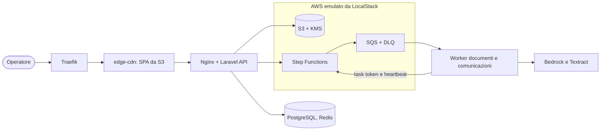

# aLittleByte MVP: AI Assistant e Co-Pilot CdL

<p>
  <a href="https://github.com/subnetMusk/alittlebyte-MVP/actions/workflows/ci.yml?query=branch%3Amain"></a>
</p>

Applicazione web per comunicazioni HR generate con l'AI e per l'analisi di documenti paga
multi-destinatario, con pipeline asincrona su servizi AWS emulati in locale.

## Origine del progetto

Progetto di gruppo del corso di **Ingegneria del Software dell'Università degli Studi di Padova**
(a.a. 2025/2026), sviluppato dal gruppo 19, **aLittleByte**, sul capitolato C5 (NEXUM) proposto da
**Eggon S.r.l.**

Questo repository è un fork personale. Il repository ufficiale del team è
[aLittleByte-19/MVP](https://github.com/aLittleByte-19/MVP); la documentazione ufficiale del progetto
(Product Baseline, fasi precedenti, glossario) è su
[alittlebyte-19.github.io/Documentazione](https://alittlebyte-19.github.io/Documentazione/). Il fork
parte dallo stato del team del 22 agosto 2026; le correzioni successive della versione ufficiale sono
state riportate in modo selettivo, indicando nei commit lo SHA di origine. Le aggiunte fatte dopo il
fork sono descritte a parte, in [Estensioni del fork personale](#estensioni-del-fork-personale).

## Cosa fa

- **AI Assistant per comunicazioni HR.** Da un prompt, un tono e uno stile genera titolo, testo e
  copertina, in modo asincrono e seguito dalla SPA via Server-Sent Events. La bozza resta
  modificabile, rigenerabile ed esportabile in PDF.
- **Co-Pilot CdL per documenti multi-destinatario.** Il consulente del lavoro carica un PDF con
  cedolini o CU di più dipendenti; il sistema lo divide in un sotto-documento per destinatario.
- **OCR.** Il testo viene letto pagina per pagina con la confidenza di ogni riga (Amazon Textract).
- **Estrazione strutturata.** Un modello (Amazon Nova Lite su Bedrock) estrae nome, codice fiscale,
  matricola, azienda, email, tipo e data del documento. L'output è validato contro uno JSON Schema;
  la confidenza di ogni campo viene dalla leggibilità OCR della sua riga, non dall'autovalutazione
  del modello ([ADR 0013](docs/architecture-decisions/0013-per-field-ocr-confidence.md)).
- **Human-in-the-loop.** L'operatore rivede e valida i campi, corregge i dati e scarica il messaggio
  di invio precompilato. L'applicazione non invia nulla da sola: il recapito avviene fuori dalla
  piattaforma.

Il perimetro completo, area per area, è in [`docs/mvp-scope.md`](docs/mvp-scope.md).

## Stack e architettura

SPA **Angular 21**; API **Laravel 12** su PHP 8.4; **PostgreSQL 16** e **Redis 7**; S3, SQS con
DLQ, Step Functions, SSM e Secrets Manager emulati da **LocalStack** e descritti in **Terraform**;
Traefik e Nginx come ingresso.



Gli elementi più interessanti:

- **Pipeline asincrona orchestrata.** Ogni passo è un task Step Functions consegnato su SQS con
  callback token. I worker reclamano il task in modo atomico, così una consegna duplicata non riesegue
  la logica; inviano heartbeat durante OCR e AI; i messaggi falliti finiscono in DLQ.
- **Architettura esagonale** nei domini Documents e Communications: il dominio e i casi d'uso
  dipendono solo da porte, gli adapter verso AWS stanno all'esterno e la Dependency Rule è verificata
  in CI ([ADR 0010](docs/architecture-decisions/0010-hexagonal-architecture-documents-communications.md)).
- **Quality gate in CI**: test backend e frontend, copertura minima sul codice modificato, analisi
  statica, audit delle dipendenze, scansione delle immagini con Trivy, audit di accessibilità, verifica
  dei link della documentazione.

Dettagli in [`docs/architecture/final-architecture.md`](docs/architecture/final-architecture.md).

## Avvio rapido

Servono Docker con Compose, Make, Git e una shell Unix-like (su Windows, Git Bash o WSL).

```bash
git clone https://github.com/subnetMusk/alittlebyte-MVP.git
cd alittlebyte-MVP
make setup
```

L'applicazione risponde su `https://localhost:8443`, Grafana su `https://grafana.localhost:8443`.
`make verify-fast` esegue in container i controlli principali della CI. Configurazione, worker e reset
sono in [`docs/runbooks/local-development.md`](docs/runbooks/local-development.md).

## Stato e limiti

- È un MVP locale, non un deploy: AWS è emulato da LocalStack e non esiste un ambiente di
  produzione.
- L'identità è simulata; ruoli e tenant sono comunque applicati lato server.
- Gli unici servizi AWS reali usati sono S3, Textract e Bedrock, e solo con credenziali e
  configurazione esplicite. Senza, l'OCR resta spento e i passi AI falliscono in modo esplicito,
  a meno di usare il profilo locale descritto sotto.

## Estensioni del fork personale

Le due estensioni seguenti sono state aggiunte o completate sul fork dopo la consegna e non fanno
parte dell'MVP ufficiale del team.

### Osservabilità self-hosted

Uno stack di osservabilità che gira insieme all'applicazione e si consulta da Grafana dopo
`make setup`:

- **OTel Collector** raccoglie le metriche di Laravel, dei worker e di Traefik; **Prometheus** le
  conserva e valuta 16 regole di alert, ognuna con il link al proprio runbook; **Alertmanager** le
  instrada.
- **Loki** e **Grafana Alloy** centralizzano i log dei container dello stack, etichettati per progetto
  e servizio.
- **Grafana** ha sei dashboard provisionate: golden signals delle API, pipeline documentale e delle
  comunicazioni, qualità di AI e OCR, code e DLQ, log ed errori.

Le metriche di dominio sono un contratto: un catalogo dichiara nomi, label e valori ammessi, e i test
falliscono se una dashboard legge una metrica inesistente o se una metrica non è osservata da
nessuno. La CI valida le configurazioni e controlla che Loki riceva davvero i log.

Lo stack nasce durante il progetto, ma la versione ufficiale lo ha poi sostituito con
un'osservabilità minima su CloudWatch. Il fork lo mantiene e lo completa: raccolta dei log per label,
healthcheck, validazione in CI, rimozione del tracing, che non aveva produttori. Dettagli in
[`docs/runbooks/observability.md`](docs/runbooks/observability.md).

### Profilo di esecuzione locale per AI e OCR

Il flusso AWS originale resta il default e il riferimento (`MVP_EXECUTION_PROFILE=standard`). Il
profilo `local` fa girare entrambi i flussi senza credenziali AWS:

- **generazione ed estrazione** con un modello Qwen servito da Ollama sull'host;
- **OCR locale e deterministico**: il text layer del PDF quando c'è, Tesseract per le pagine
  scansionate, mai un modello generativo;
- **copertina deterministica** (default), con palette e motivo scelti da tono e stile;
- **generazione locale dell'immagine**, facoltativa, tramite un provider configurabile (ComfyUI,
  con un workflow Z-Image-Turbo versionato).

Il profilo non tocca dominio né casi d'uso: ogni provider locale è un nuovo adapter dietro una porta
già esistente, scelto solo nel composition root. Step Functions, code, task token, SSE e
persistenza restano identici; prompt e validazione dell'output sono condivisi con Bedrock. Una
configurazione non valida ferma l'avvio invece di ripiegare su un altro provider.

Attivazione e prerequisiti in
[`docs/runbooks/local-development.md`](docs/runbooks/local-development.md#profilo-di-esecuzione-locale);
la decisione in [ADR 0014](docs/architecture-decisions/0014-local-execution-profile.md).

## Documentazione

L'indice è [`docs/README.md`](docs/README.md): architettura, decisioni architetturali (ADR), runbook
operativi, sicurezza, contratto OpenAPI e materiale del corso archiviato.
