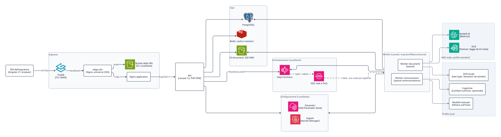

# Architettura della MVP

Questo documento descrive l'architettura runtime implementata nella MVP: i container e le loro
relazioni, cosa gira in locale tramite LocalStack e cosa può essere indirizzato verso AWS reale, i
limiti rispetto a un ambiente di produzione. L'organizzazione interna di backend e frontend è in
[`backend-hexagonal.md`](backend-hexagonal.md) e [`frontend.md`](frontend.md); metriche, log e
alert in [`../runbooks/observability.md`](../runbooks/observability.md).

## Container

*Vista container in locale. Linea continua: chiamata sincrona; tratteggio: messaggio asincrono;
grigio, nei riquadri tratteggiati: provider alternativi dei due profili. La freccia dai worker a Step
Functions è il callback con il task token. L'osservabilità ha una
[vista dedicata](../runbooks/observability.md#flusso-delle-metriche).*

L'API avvia i workflow su Step Functions. Ogni passo è un task consegnato su SQS con un callback
token ed eseguito dal worker della pipeline (documenti o comunicazioni), che risponde con
`SendTaskSuccess`, `SendTaskFailure` e `SendTaskHeartbeat`. API e worker leggono la configurazione
all'avvio da SSM Parameter Store e Secrets Manager. Nel profilo `local` Textract e Bedrock sono
sostituiti dall'OCR locale e dai modelli su Ollama e ComfyUI
([Profilo di esecuzione locale](#profilo-di-esecuzione-locale)).

Le relazioni derivano da `docker-compose.yml`, dalle definizioni ASL e da `infra/localstack/`. I
sorgenti D2 dei diagrammi sono in [`diagrams/`](diagrams/); quelli draw.io del corso sono in
[`../archive/diagrams/`](../archive/diagrams/).

## Ingresso

Traefik termina TLS su `:8443` e instrada per hostname: `localhost` verso `edge-cdn`, i sottodomini
`grafana.localhost`, `prometheus.localhost` e `alertmanager.localhost` verso le UI di osservabilità
(basic auth su Prometheus e Alertmanager).

La SPA è servita da S3 LocalStack. `make frontend-s3-local-deploy` carica `apps/frontend/dist` nel
bucket `FRONTEND_STATIC_BUCKET`; `edge-cdn`, un secondo Nginx che emula il ruolo di una CDN, serve
gli asset da quel bucket e inoltra `/api/`, `/health` e `/ready` all'Nginx applicativo. L'Nginx
applicativo resta il proxy verso PHP-FPM e contiene anche la build della SPA come percorso di
compatibilità, ma non è l'origine della SPA nel flusso predefinito. La separazione fra i due Nginx è
motivata nell'[ADR 0008](../architecture-decisions/0008-angular-frontend-static-serving.md). In
produzione il ruolo di `edge-cdn` sarebbe svolto da Amazon CloudFront, con bucket privato e OAC.

`FRONTEND_STATIC_BUCKET` e `EDGE_CDN_LOCAL_URL` valgono solo in locale per la SPA: non puntano a
bucket reali e non governano il caricamento dei documenti.

## Confine di runtime

| Livello | Componente implementato | Ruolo |
| --- | --- | --- |
| Frontend | SPA Angular/TypeScript in `apps/frontend` | Generazione assistita con avanzamento in tempo reale, upload, stato di elaborazione, revisione, anteprima ed eliminazione. |
| Edge | Traefik (TLS), emulatore CDN locale (Nginx) e Nginx applicativo | HTTPS locale, serving della SPA da S3 LocalStack, proxy API, blocco delle superfici `/admin`. |
| API | API JSON Laravel in `app/Http` | Validazione, controlli di tenant, audit event, avvio del workflow. |
| Workflow | Due state machine Step Functions e due code SQS con DLQ (LocalStack) | Orchestrazione con callback a task token, heartbeat e retry; pipeline documentale e pipeline delle comunicazioni isolate fra loro. |
| Worker | `php artisan mvp:workflow:consume --queue=documents|communications` | Un worker per pipeline: ricezione SQS, esecuzione dei task, `SendTaskSuccess`/`SendTaskFailure`, `SendTaskHeartbeat`. |
| OCR | `TextractOcrAdapter`; nel profilo local `LocalPdfOcrAdapter` | Textract reale, disabilitato di default nel profilo standard; nel profilo local text layer o Tesseract, senza servizi esterni. |
| AI | `BedrockService`; nel profilo local `OllamaService` e `CoverImageGenerator` | Bedrock reale per split ed estrazione, testo e copertine; nel profilo local un modello su Ollama e una copertina deterministica o da ComfyUI. |
| Storage | Dischi Laravel `s3` o `real_s3`, bucket `frontend_static` | S3 LocalStack per documenti, copertine delle comunicazioni e asset Angular; S3 reale opzionale solo per documenti e Textract. |
| Persistenza | PostgreSQL | Comunicazioni, documenti, sotto-documenti, dati estratti, audit e stato dei task di workflow. |
| Cache e sessione | Redis | Cache, sessione e rate limiting; non è la fonte di verità dei dati. |
| Osservabilità | OTel Collector, Prometheus, Grafana, Alertmanager | Metriche, dashboard e alert locali. |
| Log | Grafana Alloy, Loki | Raccolta e archiviazione dei log dei container, interrogabili in Grafana. |

## LocalStack e AWS reale

LocalStack emula Step Functions, SQS con DLQ, S3, EventBridge, SSM Parameter Store e Secrets Manager.
L'applicazione parla con i servizi AWS, reali o emulati, senza modifiche al codice: cambiano solo
endpoint e credenziali.

Alcune primitive sono provisionate ma non usate dall'applicazione: il bus EventBridge, con rule e
target verso SQS, e l'identità SES esistono in Terraform, ma nessun codice pubblica eventi o invia
email. Le policy IAM, per esempio l'execution role di Step Functions, sono definite a privilegio
minimo ma LocalStack non le applica: diventano effettive solo su AWS reale.

AWS reale si usa solo per validare OCR e AI, con credenziali e configurazione esplicite
(`MVP_DOCUMENT_DISK=real_s3`, `TEXTRACT_ENABLED=true`, variabili `AWS_REAL_*` e `BEDROCK_*`). La
procedura e l'elenco delle variabili sono in
[AWS reale per OCR e AI](../runbooks/local-development.md#aws-reale-per-ocr-e-ai); i permessi nella
[matrice IAM](../security/iam-and-aws-permissions.md). I test e la CI standard non chiamano S3,
Textract o Bedrock reali.

### Profilo di esecuzione locale

Estensione del fork, non parte dell'MVP
([ADR 0014](../architecture-decisions/0014-local-execution-profile.md)). Con
`MVP_EXECUTION_PROFILE=local` il composition root lega alle stesse porte gli adapter locali; workflow,
code, persistenza, SSE e contratto HTTP restano identici, e `standard` resta il profilo predefinito.

| Funzione | Profilo `standard` | Profilo `local` |
| --- | --- | --- |
| OCR | Textract (`TextractOcrAdapter`), se `TEXTRACT_ENABLED=true` | Text layer del PDF o Tesseract nel worker (`LocalPdfOcrAdapter`) |
| Split ed estrazione | Bedrock | Modello testuale su Ollama (`OllamaDocumentAiAdapter`) |
| Testo delle comunicazioni | Bedrock | Modello testuale su Ollama (`LocalCommunicationAiAdapter`) |
| Copertina | Modello immagini su Bedrock | Copertina deterministica, oppure ComfyUI se configurato |

Come attivarlo è descritto in
[`../runbooks/local-development.md`](../runbooks/local-development.md#profilo-di-esecuzione-locale).

## Percorso verso AWS reale

Il repository non crea risorse AWS reali: Terraform esiste solo per LocalStack
(`infra/localstack`). Prima di scrivere un Terraform per AWS servono decisioni che mancano: ruoli IAM
e confini fra account, remote state con lock, gestione e rotazione dei segreti, e chi possiede il
deploy. A quel punto il modello di LocalStack è la base da cui estrarre moduli riutilizzabili,
mantenendo documentate in `infra/localstack` le differenze che valgono solo in locale.

La traduzione dei componenti sarebbe diretta: PostgreSQL su RDS, Redis su ElastiCache, SQS, Step
Functions, S3 con KMS, SSM e Secrets Manager nativi, app e worker su un servizio di container (ECS o
EKS), SPA da un bucket privato dietro CloudFront con OAC. I permessi necessari sono nella
[matrice IAM](../security/iam-and-aws-permissions.md).

## Limiti rispetto alla produzione

| Area | Stato nella MVP | Intervento per la produzione |
| --- | --- | --- |
| Identità | Simulata: identità da configurazione o da header fidati ([`auth-boundary.md`](../security/auth-boundary.md)) | IdP reale con OIDC e token verificati dall'applicazione o all'edge |
| Segreti | Default locali come fallback del compose | Nessun default fuori dal locale; rotazione con Secrets Manager e invalidazione della cache di configurazione |
| Upload | Nessuna scansione antivirus né CDR sui PDF | Scansione prima della persistenza |
| Isolamento dei tenant | Filtri applicativi, senza Row-Level Security ([`postgres-rls-assessment.md`](postgres-rls-assessment.md)) | RLS PostgreSQL su `tenant_id` |
| Backup | Dump manuali (`make backup-local`), senza point-in-time recovery | Backup automatici con PITR e restore provato |
| Worker | Una replica per pipeline, scalabile a mano con `make workers` | Repliche multiple con scaling sulla profondità della coda |
| Dashboard interne | Basic auth statica davanti a Prometheus e Alertmanager | Accesso con OIDC o forward-auth |
| Alerting | Soglie statiche, receiver dimostrativo | SLO con alert sul burn rate e receiver reali |
| Metriche applicative | Archivio su file JSON con lock condiviso dai container | Storage condiviso adatto a più repliche |
| Tracing | Assente: la correlazione passa dal correlation ID nei log | SDK OpenTelemetry con propagazione del contesto attraverso SQS |
| Retention | Loki 7 giorni, Prometheus 15 (default); nessuna policy per testo OCR e prompt | Policy di retention dei dati applicativi |
| CSP | Statica in Nginx | Gestione centralizzata, con nonce o hash se servissero script dinamici |

## Mapping verso i framework di riferimento

Il confronto con i pilastri dell'AWS Well-Architected Framework è in
[`aws-well-architected-mapping.md`](aws-well-architected-mapping.md); i controlli OWASP ASVS in
[`../security/owasp-asvs-mapping.md`](../security/owasp-asvs-mapping.md); il modello di monitoring
(golden signals, Collector come gateway delle metriche, log centralizzati) in
[`../runbooks/observability.md`](../runbooks/observability.md).

## Riferimenti

- [AWS Well-Architected Framework](https://docs.aws.amazon.com/wellarchitected/latest/framework/welcome.html)
- [OWASP Application Security Verification Standard](https://owasp.org/www-project-application-security-verification-standard/)
- [Google SRE, Monitoring Distributed Systems](https://sre.google/sre-book/monitoring-distributed-systems/)
- [OpenTelemetry Collector](https://opentelemetry.io/docs/collector/)
- [Prometheus alerting](https://prometheus.io/docs/alerting/latest/overview/)
- [Grafana provisioning](https://grafana.com/docs/grafana/latest/administration/provisioning/)
