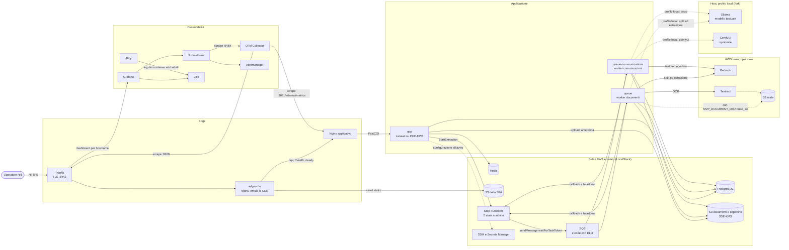

# Architettura della MVP

Questo documento descrive l'architettura runtime effettivamente implementata nella MVP: i
confini tra i componenti, cosa gira in locale tramite LocalStack e cosa può essere indirizzato
verso AWS reale, i limiti rispetto a un ambiente di produzione e i principi di qualità che trovano
riscontro nel codice. L'organizzazione interna di backend e frontend è in
[`backend-hexagonal.md`](backend-hexagonal.md) e [`frontend.md`](frontend.md); metriche, log e
alert in [`../runbooks/observability.md`](../runbooks/observability.md).

## Container

Ogni freccia corrisponde a una configurazione del repository: `docker-compose.yml`, la
configurazione dinamica di Traefik, `docker/edge-cdn/` e `docker/nginx/`, le definizioni ASL,
`docker/otel-collector/config.yml`, `docker/prometheus/prometheus.yml` e `docker/alloy/config.alloy`.

Le linee tratteggiate sono percorsi condizionali. Nel profilo `standard` (default) i worker usano
Bedrock e Textract; nel profilo `local`, un'estensione del fork, usano Ollama e ComfyUI sull'host, e
l'OCR gira dentro il worker con `pdftotext` e Tesseract. Il worker ricava la configurazione allo
stesso modo di `app`; Traefik instrada per hostname anche Prometheus e Alertmanager, dietro basic auth. I
sorgenti draw.io in [`diagrams/`](diagrams/) precedono la revisione del fork e mostrano ancora
flussi rimossi, come le trace verso Tempo: vanno rifatti e non sono più incorporati nei documenti.

## Confine di runtime

| Livello | Componente implementato | Ruolo |
| --- | --- | --- |
| Frontend | SPA Angular/TypeScript in `apps/frontend` | Generazione assistita con avanzamento in tempo reale, upload, stato di elaborazione, revisione, flussi di anteprima/eliminazione. |
| Edge | Traefik (TLS), emulatore CDN locale (Nginx) e Nginx applicativo | HTTPS locale, serving della SPA da S3 LocalStack, proxy API, blocco delle superfici `/admin`. |
| API | API JSON Laravel in `app/Http` | Validazione, controlli di tenant, audit event, avvio del workflow. |
| Workflow | Due state machine Step Functions e due code SQS con DLQ (LocalStack) | Orchestrazione con callback a task token, heartbeat e retry; pipeline documentale e pipeline delle comunicazioni isolate fra loro. |
| Worker | `php artisan mvp:workflow:consume --queue=documents|communications` | Un worker per pipeline: ricezione SQS, esecuzione dei task, `SendTaskSuccess`/`SendTaskFailure`, `SendTaskHeartbeat`. |
| OCR | `TextractOcrAdapter`; nel profilo local `LocalPdfOcrAdapter` | Textract reale, disabilitato di default nel profilo standard; nel profilo local text layer o Tesseract, senza servizi esterni. |
| AI | `BedrockService`; nel profilo local `OllamaService` e `CoverImageGenerator` | Bedrock reale per split ed estrazione, testo e copertine; nel profilo local un modello su Ollama e una copertina deterministica o da ComfyUI. |
| Storage | Dischi Laravel `s3` o `real_s3`, bucket `frontend_static` | S3 LocalStack per documenti, copertine delle comunicazioni e asset Angular, S3 reale opzionale solo per documenti/Textract. |
| Persistenza | PostgreSQL | Comunicazioni, documenti, sotto-documenti, dati estratti, audit e stato dei task di workflow. |
| Cache/sessione | Redis | Cache/sessione e rate limiting; non è la fonte di verità dei dati. |
| Osservabilità | OTel Collector, Prometheus, Grafana, Alertmanager | Metriche, dashboard e alert locali. |
| Log | Grafana Alloy, Loki | Raccolta e archiviazione dei log dei container, interrogabili in Grafana. |

## LocalStack e AWS reale

LocalStack fornisce le primitive di orchestrazione production-like testabili in locale:
Step Functions, SQS/DLQ, S3, EventBridge, SSM Parameter Store e Secrets Manager. L'applicazione
parla con i servizi AWS, reali o emulati, **senza cambiare codice**: cambiano solo endpoint e
credenziali.

La SPA Angular usa come default locale il percorso `Traefik -> edge-cdn -> S3
LocalStack`: `make frontend-s3-local-deploy` carica `apps/frontend/dist` nel bucket
`FRONTEND_STATIC_BUCKET`, poi `https://localhost:8443` serve gli asset da quel bucket. Il
servizio `edge-cdn` è un **secondo Nginx** che emula in locale il **ruolo di una
CDN/edge** (non Amazon CloudFront): serve gli asset statici e inoltra `/api/`, `/health` e
`/ready` all'Nginx applicativo/Laravel. È un container separato dall'Nginx applicativo di
proposito: quest'ultimo è un'immagine di produzione (buildata, scansionata, pubblicata) e non
deve conoscere LocalStack, mentre il serving da S3 emulato resta confinato in uno scaffolding
solo-locale; la separazione riflette anche la topologia reale CDN → origin. L'Nginx applicativo
resta il proxy verso PHP-FPM e il percorso interno di compatibilità (include la build SPA), ma
non è l'origine primaria della SPA nel flusso default. L'emulazione non sostituisce una CDN
reale: in produzione il ruolo sarebbe ricoperto da AWS CloudFront (bucket privato + OAC,
invalidation, edge propagation).

Alcune primitive sono provisionate ma **non esercitate** dall'applicativo: il bus EventBridge
(con rule e target verso SQS) e l'identità SES esistono in Terraform, ma nessun codice pubblica
eventi o invia email. Le policy IAM (es. execution role di Step Functions) sono definite come
least-privilege *documentata* ma **non applicate da LocalStack** in locale: diventano effettive
solo sul percorso AWS reale.

AWS reale viene usato solo per il percorso critico di validazione AI/OCR, quando sono fornite
credenziali e configurazione esplicite:

- `MVP_DOCUMENT_DISK=real_s3`
- `AWS_REAL_REGION`
- `AWS_REAL_ACCESS_KEY_ID`
- `AWS_REAL_SECRET_ACCESS_KEY`
- `AWS_REAL_SESSION_TOKEN`, quando necessario
- `AWS_REAL_S3_BUCKET`
- `AWS_REAL_S3_PREFIX`
- `BEDROCK_REGION`
- `BEDROCK_MODEL_ID`
- `TEXTRACT_ENABLED=true`

Le variabili `FRONTEND_STATIC_BUCKET` e `EDGE_CDN_LOCAL_URL` sono locali e dedicate
alla SPA: non devono puntare a bucket reali e non governano il caricamento documenti.

I test e la CI standard non chiamano S3, Textract o Bedrock reali.

### Profilo di esecuzione locale

Estensione del fork, non parte dell'MVP ([ADR 0014](../architecture-decisions/0014-local-execution-profile.md)).
`MVP_EXECUTION_PROFILE=local` lega alle stesse porte adapter locali: `OllamaDocumentAiAdapter`,
`LocalCommunicationAiAdapter` e `LocalPdfOcrAdapter`. Lo fa solo il composition root:
workflow, code, persistenza, SSE e contratto HTTP restano identici, e il profilo `standard` resta
il default. Come attivarlo è descritto in
[`../runbooks/local-development.md`](../runbooks/local-development.md#profilo-di-esecuzione-locale).

## Percorso verso AWS reale

Il repository non crea risorse AWS reali: Terraform esiste solo per LocalStack
(`infra/localstack`). Prima di scrivere un Terraform per AWS servono decisioni che oggi mancano:
ruoli IAM e confini fra account, remote state con lock, gestione e rotazione dei segreti, e chi
possiede il deploy. A quel punto il modello di LocalStack è la base da cui estrarre moduli
riutilizzabili, mantenendo documentate in `infra/localstack` le differenze che valgono solo in
locale.

La traduzione dei componenti sarebbe diretta: PostgreSQL su RDS, Redis su ElastiCache, SQS, Step
Functions, S3 con KMS, SSM e Secrets Manager nativi, app e worker su un servizio di container (ECS o
EKS), SPA da un bucket privato dietro CloudFront con OAC. I permessi necessari sono nella
[matrice IAM](../security/iam-and-aws-permissions.md).

## Limiti rispetto alla produzione

| Area | Stato nella MVP | Intervento per la produzione |
| --- | --- | --- |
| Identità | Simulata: identità da configurazione o da header fidati ([`auth-boundary.md`](../security/auth-boundary.md)) | IdP reale con OIDC e token verificati dall'applicazione o all'edge |
| Segreti | Default locali come fallback del compose | Nessun default fuori dal locale; rotazione con Secrets Manager e invalidazione della cache di configurazione |
| Upload | Nessuna scansione antivirus né CDR sui PDF | Scansione prima della persistenza |
| Isolamento dei tenant | Filtri applicativi, senza Row-Level Security ([`postgres-rls-assessment.md`](postgres-rls-assessment.md)) | RLS PostgreSQL su `tenant_id` |
| Backup | Dump manuali (`make backup-local`), senza point-in-time recovery | Backup automatici con PITR e restore provato |
| Worker | Una replica per pipeline, scalabile a mano con `make workers` | Repliche multiple con scaling sulla profondità della coda |
| Dashboard interne | Basic auth statica davanti a Prometheus e Alertmanager | Accesso con OIDC o forward-auth |
| Alerting | Soglie statiche, receiver dimostrativo | SLO con alert sul burn rate e receiver reali |
| Metriche applicative | Archivio su file JSON con lock condiviso dai container | Storage condiviso adatto a più repliche |
| Tracing | Assente: la correlazione passa dal correlation ID nei log | SDK OpenTelemetry con propagazione del contesto attraverso SQS |
| Retention | Loki 7 giorni, Prometheus 15; nessuna policy per testo OCR e prompt | Policy di retention dei dati applicativi |
| CSP | Statica in Nginx | Gestione centralizzata, con nonce o hash se servissero script dinamici |

## Principi di qualità implementati

| Principio di riferimento | Implementazione concreta |
| --- | --- |
| AWS Well-Architected: operational excellence | Avvio ripetibile via Docker/Terraform, endpoint `/health` e `/ready`, target `make verify*`. |
| AWS Well-Architected: reliability | Retry/catch espliciti in Step Functions, heartbeat per task, DLQ SQS, tabella di workflow idempotente. |
| AWS Well-Architected: security | Nessuna UI di amministrazione runtime, nessun segreto reale committato (gitleaks sull'intera history in CI), header di sicurezza e CSP in Nginx, [matrice IAM a privilegio minimo](../security/iam-and-aws-permissions.md) documentata. |
| Baseline OWASP ASVS/API | Validazione upload server-side, controlli di ownership per tenant, rate limit, confine di autenticazione strutturato. |
| Google SRE: monitoring | Metriche API golden-signal, metriche di entrambe le pipeline, alert code/DLQ per dominio con runbook. |
| Modello OpenTelemetry | Il Collector è il gateway delle metriche: raschia l'exporter applicativo e Traefik e le espone a Prometheus. Il tracing distribuito non è implementato. |
| Logging centralizzato | Grafana Alloy invia a Loki i log dei container etichettati per la raccolta, interrogabili in Grafana accanto alle metriche. |

## Riferimenti principali

- AWS Well-Architected Framework: https://docs.aws.amazon.com/wellarchitected/latest/framework/welcome.html
- OWASP ASVS: https://owasp.org/www-project-application-security-verification-standard/
- Google SRE: Monitoring Distributed Systems: https://sre.google/sre-book/monitoring-distributed-systems/
- OpenTelemetry Collector: https://opentelemetry.io/docs/collector/
- Prometheus alerting: https://prometheus.io/docs/alerting/latest/overview/
- Grafana provisioning: https://grafana.com/docs/grafana/latest/administration/provisioning/
