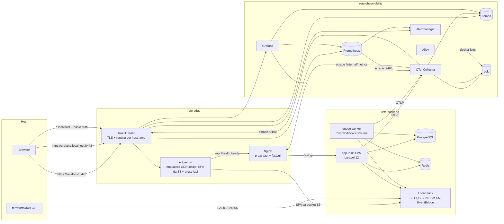
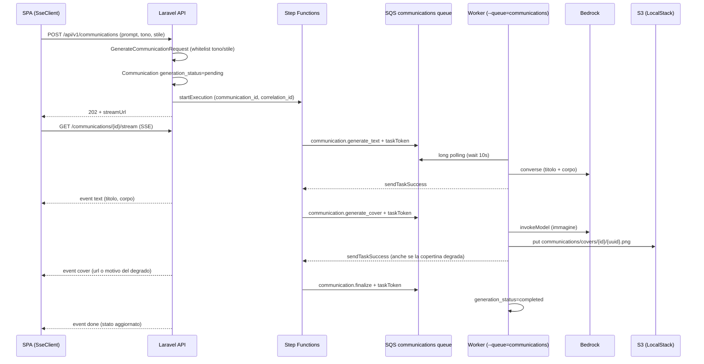
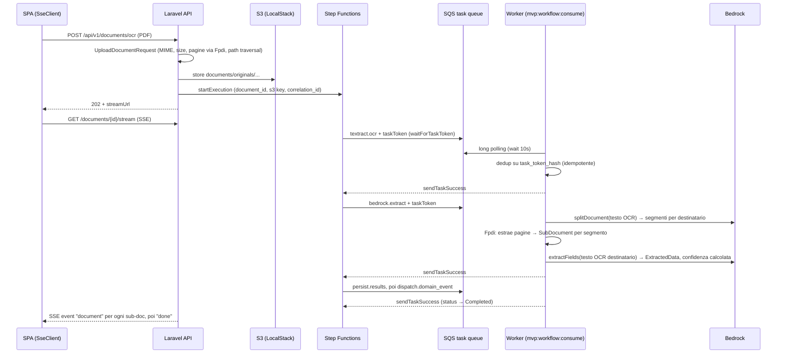

# Panoramica implementativa dell'applicativo

> **Documento archiviato.** Fotografia della codebase al 15/08/2026, prodotta per la valutazione
> del corso e non più aggiornata. Alcune parti non descrivono più il runtime: per esempio Tempo, le
> trace OTLP e il conteggio degli alert. Lo stato corrente è in
> [`../architecture/final-architecture.md`](../architecture/final-architecture.md) e nei runbook.

> Documento aggiornato tramite analisi diretta della codebase.
> Branch analizzato: integration/develop_merge.
> Ultimo aggiornamento: 2026-08-15.

---

## 1. Executive summary tecnico

L'applicativo è una MVP di **pipeline documentale HR assistita da AI** composta da due moduli funzionali: un **AI Assistant** che genera comunicazioni aziendali a partire da un prompt (tono e stile vincolati), e un **Co-Pilot CdL** che riceve PDF di qualsiasi tipologia, ne riconosce tipo e destinatari (sempre almeno uno) dal testo OCR tramite LLM, li separa in sotto-documenti per destinatario, ne estrae campi strutturati e ne traccia lo stato di lavorazione con una confidenza attribuita **campo per campo** — quella della riga OCR da cui il campo proviene — di cui il punteggio del sotto-documento è il minimo sui campi chiave (ADR 0013).

Il backend è **Laravel 12 / PHP 8.4** con PostgreSQL e Redis; il frontend è una **SPA Angular + TypeScript** servita di default tramite **Traefik → emulatore CDN locale (Nginx) → S3 LocalStack**, con Nginx applicativo come proxy per `/api/`, `/health` e `/ready`. Entrambi i flussi AI sono asincroni: due **state machine AWS Step Functions** (emulate in LocalStack) orchestrano i task via **SQS con callback task token**, ciascuna con la propria coda e il proprio worker Laravel dedicato. Le integrazioni AI usano **AWS Bedrock** (classificazione/split ed estrazione campi sul testo OCR e generazione del testo delle comunicazioni via Converse, copertine via `invokeModel` su un modello immagini in una region propria) e **AWS Textract** per l'OCR che alimenta la pipeline documentale (necessario per l'analisi, attivabile solo con S3 reale). La configurazione runtime arriva da **SSM Parameter Store + Secrets Manager**, caricata prima del boot di Laravel.

L'osservabilità è il tratto più maturo della MVP: metriche golden-signal e di dominio esposte in formato Prometheus, trace OTLP verso Tempo, log dei container verso Loki via Alloy, 15 alert rule, 6 dashboard Grafana provisioned e runbook collegati. La CI (GitHub Actions) copre lint, analisi statica, test backend e frontend, scansione Trivy delle immagini, validazione Terraform e audit di accessibilità axe/pa11y contro lo stack reale.

Il livello di maturità è **alto per una MVP**: confini architetturali chiari, validazione input sistematica, idempotenza nel workflow, audit trail, hardening container e di rete. Non è production-ready per scelta dichiarata di scope: deploy reale, autenticazione degli utenti e invio delle comunicazioni sono stati esclusi esplicitamente dal committente il 15/07/2026, e restano fuori perimetro anche gestione segreti non-default e ridondanza operativa (dettagli in §17-19). L'obiettivo prioritario indicato dal committente è la **corretta identificazione del destinatario**.

---

## 2. Perimetro dell'analisi

L'analisi si basa sullo **stato attuale del codice**: route, controller, service, migration, configurazioni Docker/Traefik/Terraform, workflow CI, script operativi e test sono stati letti direttamente. I file Markdown preesistenti (README, runbook, guideline) sono stati usati solo come contesto secondario; ogni affermazione tecnica rilevante in questo documento è ancorata a un path verificato. Dove una funzionalità risulta solo predisposta o simulata, è dichiarato esplicitamente. Non viene descritta la storia delle modifiche: solo ciò che esiste ora.

---

## 3. Mappa della codebase

| Area | Path | Responsabilità |
|---|---|---|
| Backend applicativo | `app/` | Controller HTTP divisi per area in `Http/Controllers/Api/V1/` (bozze, stream, copertine, export, rating; documenti, revisione, anteprima, messaggio di invio) con le guardie condivise su attore e tenant in `Http/Controllers/Api/V1/Concerns/`; middleware, model, console command |
| Domini MVP | `app/Mvp/` | `Documents/` (Co-Pilot) e `Communications/` (AI Assistant) seguono l'architettura esagonale (ports & adapters: `Domain/`, `Application/UseCases/`, `Adapters/{Primary,Outbound}/` — [ADR 0010](../architecture-decisions/0010-hexagonal-architecture-documents-communications.md)); `Ai/` (Bedrock), `Workflow/` (infrastruttura di orchestrazione comune, include la porta condivisa `WorkflowEnginePort`), `Identity/`, `Audit/`, `Observability/`, `Support/` restano service layer per dominio, fuori dal perimetro esagonale per scelta esplicita dell'ADR |
| Route | `routes/api.php`, `routes/web.php` | API v1 + endpoint di sistema |
| Schema dati | `database/migrations/` | 7 tabelle di dominio + indici/FK |
| Frontend SPA | `apps/frontend/` | Angular + TypeScript, client API Angular generato |
| Contratto API | `openapi/v1/alittlebyte-mvp-api.yaml` | OpenAPI 3.1, fonte del client frontend |
| Infrastruttura locale | `docker-compose.yml`, `docker/` | 22 servizi: app, due worker (uno per pipeline), nginx, edge-cdn, traefik, datastore, stack osservabilità, tool |
| Infrastruttura AWS (emulata) | `infra/localstack/` | Terraform: due coppie SQS+DLQ, S3 documenti, S3 frontend, SSM, Secrets Manager, EventBridge, IAM, due Step Functions, SES identity |
| State machine | `infra/localstack/state-machines/` | Definizioni ASL delle pipeline documentale e comunicazioni |
| Osservabilità | `docker/otel-collector/`, `docker/prometheus/`, `docker/grafana/`, `docker/loki/`, `docker/alloy/`, `docker/tempo/`, `docker/alertmanager/` | Collector, scrape, alert rule, dashboard, log shipping |
| CI | `.github/workflows/ci.yml`, `mirror-images.yml`, `scripts/ci/` | Pipeline composta da 4 job (backend, frontend, coverage diff, stack) su ogni push di ogni branch, con mirroring immagini su GHCR |
| Test | `tests/` (backend Pest), `apps/frontend/src/**/*.spec.ts` (Jest) | Feature + Unit backend, unit/component test frontend |
| Audit a11y | `scripts/a11y/axe-playwright.mjs`, `pa11y-runner.mjs` | Audit automatici contro lo stack reale |
| Operatività | `Makefile`, `docs/runbooks/` | Setup riproducibile, comandi verifica, runbook per alert |
| TLS locale | `scripts/tls/generate-local-cert.sh` | Cert self-signed con SAN `*.localhost` (artefatto runtime, gitignored) |

---

## 4. Architettura generale

Tre reti Docker segmentate per least privilege (`docker-compose.yml`, blocco `networks:` in coda al file):

- **edge**: Traefik ↔ Nginx, più i container di audit frontend;
- **backend**: app PHP-FPM, worker queue, Postgres, Redis, LocalStack, Terraform, e l'OTel Collector per l'ingest;
- **observability**: collector, Prometheus, Tempo, Loki, Alloy, Alertmanager, Grafana; Traefik vi partecipa solo per instradare le dashboard e per esporre le proprie metriche.

Le uniche porte pubblicate sull'host sono Traefik `8080/8443` (la 8080 redirige globalmente su HTTPS, `docker/traefik/traefik.yml`) e LocalStack su `127.0.0.1:4566`. Postgres, Redis e tutte le UI di osservabilità non espongono porte host.

Confini di responsabilità: Traefik termina TLS e applica auth alle dashboard; l'emulatore CDN locale (`edge-cdn`, un secondo Nginx) serve la SPA da S3 LocalStack e inoltra `/api/`, `/health` e `/ready` all'Nginx applicativo, che resta il proxy verso PHP-FPM (oltre a poter servire la SPA in modalità standard dall'immagine); Laravel gestisce validazione, identità, persistenza e orchestrazione; Step Functions (LocalStack) detiene lo stato del workflow; il worker esegue i task e risponde con i task token; il collector è l'unico punto di raccolta telemetria.

---

## 5. Tecnologie rilevate e ruolo nel sistema

### Laravel 12 / PHP 8.4 (backend)

**Dove**: `composer.json`, `app/`, `bootstrap/app.php`, `docker/php/Dockerfile` (`FROM php:8.4-fpm-bookworm`).
**Ruolo**: API REST stateless, validazione (FormRequest), ORM Eloquent, console worker, exception mapping centralizzato (`bootstrap/app.php:64-149`; ogni errore esce come JSON con `code`, `message`, `requestId`, `correlationId`).
**Motivazione**: framework maturo con primitive pronte per validazione, queue, storage astratto (flysystem) e testing; coerente con lo stack del team.
**Valutazione**: buona separazione controller→service (i controller orchestrano, la logica vive in `app/Mvp/*`); error handling uniforme; niente logica nei model oltre a cast/relazioni.
**Best practice**: la struttura segue le convenzioni Laravel ufficiali; il mapping degli errori con correlation ID è in linea con le raccomandazioni API di OWASP ASVS (V7, error handling senza leak di dettagli interni).

### PostgreSQL 16

**Dove**: `docker-compose.yml` (servizio `postgres`, `postgres:16-alpine`), `config/database.php:91`, `database/migrations/`.
**Ruolo**: persistenza di comunicazioni, documenti, sotto-documenti, dati estratti, audit trail e task di workflow.
**Motivazione**: vincoli CHECK sugli stati, JSON nativo per payload e metadata, FK con cascade; tutte feature usate realmente nelle migration.
**Valutazione**: schema con indici mirati (es. `(tenant_id, processing_status)` su `original_documents`), FK `cascadeOnDelete` su `sub_documents`/`extracted_data`, unique su `task_token_hash`. Nessuna porta host esposta. Limite: multi-tenancy solo applicativa (vedi §7).

### Redis 7

**Dove**: `docker-compose.yml` (servizio `redis`), `config/database.php:161-189`, `config/cache.php`.
**Ruolo**: cache, sessioni e contatori di rate limiting.
**Motivazione**: i throttle per-route (`routes/api.php`) richiedono uno store condiviso tra i processi PHP-FPM.
**Valutazione**: hardening sopra la media per una MVP; `requirepass`, `maxmemory 256mb` con policy `volatile-lru` scelta consapevolmente (il commento nel compose spiega che `allkeys-lru` azzererebbe i rate limit evictando chiavi senza TTL), healthcheck autenticato via `REDISCLI_AUTH` senza password in argv, nessuna porta host.

### Angular + TypeScript (frontend)

**Dove**: `apps/frontend/package.json`, `apps/frontend/angular.json`, `apps/frontend/src/app/`.
**Ruolo**: SPA a tre viste (`overview`, `assistant`, `copilot`) con Angular Router, shell operativa, pannelli per generazione comunicazioni, upload documenti, storici, revisione e metriche. Il linguaggio visivo — token, primitivi condivisi, glifi di stato, forme delle schede metrica — è quello dell'[ADR 0012](../architecture-decisions/0012-frontend-design-system-and-ui-language.md); i ViewModel puri e il client SSE quello dell'[ADR 0011](../architecture-decisions/0011-frontend-presentation-model-and-sse-client.md).
**Motivazione**: allineamento al Capitolato, build statica production-like, deep link top-level e client API generato per HttpClient.
**Valutazione**: stato condiviso via store Angular a signal (`MvpStateStore`), servizi feature per mutazioni e SSE, stati loading/error/empty espliciti, dark mode via token CSS (`src/styles/tokens.css`, `data-mvp-theme` + `prefers-color-scheme`), request/correlation id propagati con interceptor. La build di produzione disabilita l'inline critical CSS per restare compatibile con CSP severa.

### OpenAPI 3.1 + Orval (contratto API)

**Dove**: `openapi/v1/alittlebyte-mvp-api.yaml`, `apps/frontend/orval.config.ts`, output in `src/api/generated/`.
**Ruolo**: contract-first; il servizio Angular/HttpClient e i model TypeScript del frontend sono generati dal contratto; la CI lo lint-a con Redocly e **fallisce se il client generato non è committato** (`ci.yml`, step "Check generated client is committed").
**Motivazione**: elimina la deriva tra backend e frontend sui tipi delle risposte.
**Valutazione**: ottima scelta per manutenibilità; l'accesso API passa da servizi Angular (`AssistantService`, `DocumentWorkflowService`, `MvpStateStore`) che usano il servizio Orval generato. Gap: il contratto non è validato a runtime contro le risposte reali del backend (nessun contract test automatico lato Laravel oltre a `HealthAndApiContractTest`).

### Traefik v3.4 (edge router)

**Dove**: `docker/traefik/traefik.yml`, `docker/traefik/dynamic/http.yml`, `docker/traefik/usersfile`.
**Ruolo**: unico entrypoint: TLS, redirect globale HTTP→HTTPS, routing per hostname (`localhost`/`mvp.localhost` → nginx; `grafana|prometheus|alertmanager|tempo.localhost` → rispettivi servizi), basic auth (htpasswd bcrypt) sulle UI prive di autenticazione nativa, metriche Prometheus su entrypoint dedicato `:9100`, dashboard API disabilitata.
**Motivazione**: riproduce in piccolo il pattern di produzione (edge unico, servizi interni mai esposti) e rende la MVP dimostrabile in LAN senza aprire porte sensibili.
**Valutazione**: configurazione pulita e minimale; TLS ≥1.2; access log JSON. La basic auth è dichiaratamente una soluzione da MVP (in produzione: forward-auth/OIDC o non-esposizione, vedi §13).

### Nginx 1.27 (static + fastcgi)

**Dove**: `docker/nginx/Dockerfile` (multi-stage: build SPA con node:22 → runtime `nginx:1.27-alpine`, `USER nginx`), `docker/nginx/default.conf`.
**Ruolo**: nel flusso default è il proxy applicativo; inoltra `/api/` e gli endpoint di sistema a PHP-FPM e applica i security header (X-Frame-Options, X-Content-Type-Options, Referrer-Policy, Content-Security-Policy). L'immagine include anche la SPA Angular buildata e può servirla in modalità standard con fallback `try_files ... /index.html`, percorso alternativo all'emulatore CDN locale (`edge-cdn`), che invece è l'origine default della SPA da S3 LocalStack.
**Dettaglio rilevante**: `/internal/metrics` non è servito dal listener edge `:8080` usato da Traefik; ritorna 404 dall'esterno. Lo scrape passa dal listener interno `nginx:8081/internal/metrics`, raggiungibile solo sulle reti Docker interne. La CI verifica sia il 404 esterno sia la raggiungibilità interna.
**Gap**: la CSP è locale e mirata alla SPA attuale; eventuali nuovi asset remoti o embedding esterni richiedono aggiornamento esplicito della policy.

### Emulatore CDN locale (edge-cdn)

**Dove**: `docker/edge-cdn/default.conf.template` (config Nginx parametrizzata via `envsubst`), servizio `edge-cdn` in `docker-compose.yml` (immagine `nginx:1.29-alpine`), target `make frontend-s3-local-deploy`/`frontend-s3-local-upload`.
**Ruolo**: emula in locale il layer CDN/edge che in produzione sarebbe Amazon CloudFront. È l'**origine di default della SPA**: serve gli asset statici Angular leggendoli da S3 LocalStack (`/` → bucket `index.html`; le altre richieste sono proxate al bucket con fallback deep-link `@spa_index` su `index.html`, intercettando 403/404), e fa da **reverse proxy** verso Nginx per `/api/`, `/health`, `/ready`. È il primo hop dopo Traefik (`Traefik → edge-cdn → {S3 LocalStack | Nginx}`).
**Security header**: applica a livello server gli header edge (CSP `frame-ancestors 'none'`, X-Frame-Options `SAMEORIGIN`, X-Content-Type-Options, Referrer-Policy) sugli asset statici. Sulle risposte `/api/` non sovrascrive gli header dell'origine: un `add_header` dedicato nella `location /api/` interrompe l'ereditarietà nginx, così resta valida la CSP differenziata dell'app (in particolare `frame-ancestors 'self'` per l'anteprima PDF in iframe, che altrimenti verrebbe bloccata dalla doppia CSP).
**Motivazione**: validare il percorso reale build → upload su object storage → distribuzione edge senza dipendere da CloudFront vero; tiene il serving statico della SPA (e ogni riferimento a LocalStack) fuori dall'immagine Nginx applicativa, che è un artefatto di produzione. In produzione il ruolo sarebbe ricoperto da AWS CloudFront.
**Valutazione**: riproduce in modo fedele il flusso S3-origin + edge proxy e la separazione asset/API. Gap: non copre OAC, invalidation della cache, signed URL né la propagazione edge reali (limiti dichiarati, §11); convive con la versione 1.27 dell'Nginx applicativo (due immagini Nginx distinte con ruoli diversi).

### AWS Bedrock (LLM)

**Dove**: `app/Mvp/Ai/BedrockService.php` (due client `BedrockRuntimeClient` costruiti in `AppServiceProvider` con timeout 300s: uno per i modelli testo, uno per quelli immagine, che sono serviti in region diverse), config in `config/services.php` (`model_id`, `image_model_id`, `region`, `image_region`, `endpoint`, credenziali AWS reali opzionali; default `amazon.nova-lite-v1:0` e `stability.sd3-5-large-v1:0` da `docker-compose.yml`).
**Ruolo**: quattro operazioni (`generateCommunication()` (JSON `{title, body, imagePrompt}` da prompt+tono+stile: lo stesso modello scrive anche la direzione visiva della copertina, avendo davanti il testo appena generato), `generateCommunicationImageWithMeta()` (copertina via `invokeModel`, con payload derivato dalla famiglia del modello configurato) Stability SD3/Core, Stability XL, Nova Canvas), `splitDocument()` (segmenti per destinatario dal testo OCR), `extractFields()` (campi strutturati dal testo OCR; la confidenza effettiva è calcolata a valle riconducendo ogni campo alla riga OCR da cui proviene, e il punteggio del sotto-documento è il minimo sui campi chiave — ADR 0013). Le operazioni testuali usano Converse, la generazione immagini `invokeModel`.
**Valutazione**: ogni risposta è trattata come input non attendibile; parsing difensivo (estrazione JSON da fence markdown con fallback regex) seguito da validazione contro JSON Schema in `AiOutputValidator` (`resources/schemas/ai/`) più le regole semantiche che uno schema non esprime; errori AWS mappati su `AiServiceException` → 502 con messaggio user-friendly, metriche di fallimento dedicate (`BedrockFailureRateHigh` alert). Sugli errori immagine la classificazione distingue i casi permanenti (accesso negato, modello non attivo, credenziali) da quelli ritentabili, evitando tentativi certi di fallire.
**Gap**: nessuna mitigazione esplicita di prompt injection veicolata dal contenuto del PDF; nessun circuit breaker (solo retry SDK).

### AWS Textract (OCR, opzionale)

**Dove**: `app/Mvp/Documents/Adapters/Outbound/Ocr/TextractOcrAdapter.php`, flag `TEXTRACT_ENABLED` (`config/services.php`).
**Ruolo**: OCR asincrono (`startDocumentTextDetection` + polling con timeout configurabile), confidence media, testo salvato su `original_documents.ocr_text` e per pagina su `original_documents.ocr_pages` (usato da split ed estrazione). Ogni pagina porta anche l'elenco `blocks` — testo e confidenza di ciascuna riga — da cui si attribuisce la confidenza ai singoli campi (ADR 0013).
**Dettaglio rilevante**: guard architetturale in `StartDocumentWorkflowService::start()`; se Textract è abilitato ma il disco documenti non è `real_s3`, il workflow rifiuta di partire con errore esplicito (Textract reale non può leggere il bucket LocalStack). È un esempio concreto di fail-fast su configurazioni incoerenti.
**Stato**: implementato ma **disabilitato di default** (`TEXTRACT_ENABLED=false`); con flag off il task ritorna `enabled=false` e la pipeline prosegue.

### AWS Step Functions + SQS (workflow asincrono)

**Dove**: `infra/localstack/state-machines/` (document e communication pipeline), `infra/localstack/main.tf` (state machine, code + DLQ per dominio, IAM role/policy, EventBridge), `app/Mvp/Workflow/` (runner, registry, heartbeat, contesto di correlazione, `WorkflowEnginePort`/`SfnWorkflowEngineAdapter`), `app/Mvp/Documents/Application/UseCases/StartDocumentWorkflowService.php` e `Adapters/Primary/Workflow/DocumentWorkflowTaskHandler.php`, `app/Mvp/Communications/Application/UseCases/StartCommunicationWorkflowService.php` e `Adapters/Primary/Workflow/CommunicationWorkflowTaskHandler.php`, `app/Console/Commands/ConsumeWorkflowTasks.php`.
**Ruolo**: la state machine usa il **callback pattern** (`arn:aws:states:::sqs:sendMessage.waitForTaskToken`): ogni stato pubblica su SQS un messaggio con task token e tipo (`textract.ocr`, `bedrock.extract`, `persist.results`, `dispatch.domain_event`); il worker Laravel esegue e risponde con `sendTaskSuccess/Failure`. Retry dichiarativi nello ASL (2 tentativi, backoff 2x), timeout per stato (420s Textract, 720s Bedrock), `Catch` → stato `Failed`.
**Motivazione**: separa lo stato del workflow dall'esecutore; i task pesanti (LLM, OCR) escono dal ciclo HTTP; la DLQ cattura i messaggi non processabili.
**Valutazione**: **idempotenza reale**; `workflow_tasks.task_token_hash` (SHA-256, unique) deduplica i re-delivery SQS e un task già `succeeded/skipped` ritorna il risultato cached senza rieseguire. **Heartbeat implementato**: l'ASL dichiara `HeartbeatSeconds` per ogni task (180s Textract, 240s Bedrock, 90s persist/dispatch) e il worker invia `SendTaskHeartbeat` tramite `WorkflowTaskHeartbeat` durante il polling Textract e tra i segmenti Bedrock (`TextractOcrAdapter`, `ProcessDocumentService`); un heartbeat rifiutato degrada a no-op senza abortire il task di business. È il punto più sofisticato del backend.
**Gap vs best practice AWS** ([Step Functions best practices](https://docs.aws.amazon.com/step-functions/latest/dg/sfn-best-practices.html)): in compose gira una sola replica del worker (`restart: unless-stopped`), anche se il design è già concorrenza-safe (claim atomico via `task_token_hash` + `MVP_WORKFLOW_CLAIM_TTL_SECONDS`, `visibility_timeout_seconds` SQS 900s > timeout ASL massimo 720s); in LocalStack il comportamento di SFN non è identico ad AWS (Express vs Standard, quota, exactly-once non garantito).

### LocalStack 4.5 + Terraform 1.10

**Dove**: `docker-compose.yml` (servizio `localstack`, servizi emulati: `s3,sqs,stepfunctions,ssm,secretsmanager,events,ses,iam,sts,logs`), `infra/localstack/*.tf`.
**Ruolo**: emula AWS in locale; Terraform provisiona S3 (con SSE-KMS e public access block), SQS+DLQ, SSM parameter, secret JSON, EventBridge bus+rule (predisposti per gli eventi terminali della pipeline ma non esercitati: l'app non pubblica eventi), IAM role per SFN, identità SES.
**Motivazione**: l'app parla con AWS vero o emulato **senza cambiare codice**; cambiano solo endpoint e credenziali. Il provisioning è codificato, ripetibile e validato in CI (`terraform fmt -check`, `init`, `validate`).
**Valutazione**: buona fedeltà al deployment reale (KMS, public access block, IAM, bus EventBridge e identità SES sono configurati ma non applicati/esercitati a runtime: LocalStack non valuta le policy IAM e l'app non pubblica eventi né invia email); lo stato Terraform è locale e committato (`terraform.tfstate` nel repo; accettabile solo perché contiene risorse fake).

### SSM Parameter Store + Secrets Manager (config runtime)

**Dove**: `app/Mvp/Support/RuntimeConfigurationLoader.php`, agganciato in `bootstrap/app.php:25` **prima** del caricamento env di Laravel; bootstrap minimo via `CONFIG_*` env (`docker-compose.yml`, anchor `x-backend-environment`).
**Ruolo**: con `CONFIG_SOURCE=aws` la configurazione applicativa (APP_KEY, credenziali DB/Redis, code, bucket, model id…) viene letta da `getParametersByPath` (con decryption) + `getSecretValue`, popolata in `$_ENV` e **cachata su file con fingerprint** (`bootstrap/cache/runtime-config.php`) per non chiamare AWS a ogni richiesta PHP-FPM. Chiavi obbligatorie asserite a bootstrap (fail-fast).
**Motivazione**: implementa il principio [Twelve-Factor config](https://12factor.net/config) e simula il pattern di produzione (nessun segreto applicativo nel filesystem dell'immagine); i container ricevono solo le credenziali di bootstrap.
**Valutazione**: design production-like raro in una MVP. Gap: la cache su file non ha invalidazione runtime (serve riavvio o cancellazione cache per rotazione segreti).

### OpenTelemetry Collector + Prometheus + Tempo + Loki + Alloy + Grafana + Alertmanager

**Dove**: `docker/otel-collector/config.yml`, `docker/prometheus/{prometheus.yml,rules/}`, `docker/tempo/`, `docker/loki/`, `docker/alloy/config.alloy`, `docker/grafana/{provisioning,dashboards}/`, `docker/alertmanager/`.
**Ruolo e flusso**: il collector è l'**unico punto di raccolta**; riceve OTLP (gRPC/HTTP) da app e worker, scrappa `/internal/metrics` via nginx e le metriche Traefik `:9100`, e re-espone tutto su `:9464` dove Prometheus fa un solo scrape. Trace → Tempo (OTLP), log applicativi → Loki (ingestion OTLP nativa di Loki 3.x); Alloy raccoglie i log dei container (filtrati per label compose project) e li spedisce a Loki. Grafana ha datasource provisioned da file (Prometheus/Tempo/Loki, non editabili) e 6 dashboard versionate: `api-golden-signals`, `document-pipeline`, `communication-pipeline`, `ai-ocr-quality`, `queues-and-dlq`, `logs-and-errors`.
**Alerting**: 16 regole in 5 file (`docker/prometheus/rules/`): `WorkerDown`, `DocumentStuckInProcessing`, `StepFunctionExecutionFailed`, `TextractFailureRateHigh`, `BedrockFailureRateHigh`, `TargetDown`, `APIHighErrorRate`, `APIHighLatencyP95`, `QueueBacklogHigh`, `DLQNotEmpty`, `DlqProbeDown`, `CommunicationPipelineTaskFailed`, `CommunicationStuckInProcessing`, `CommunicationCoverGenerationDegraded`, `CommunicationCoverStorageFailing`, `CommunicationDLQNotEmpty`; ognuna rimanda a un runbook in `docs/runbooks/`.
**Motivazione**: copre i [quattro golden signal SRE](https://sre.google/sre-book/monitoring-distributed-systems/) (latency, traffic, errors, saturation) più le metriche di dominio della pipeline.
**Valutazione**: architettura corretta (un solo collettore, processori `memory_limiter`+`batch`, config validate in CI con `promtool` e `otelcol validate` via `make observability-config`). Gap: niente retention/SLO formalizzati; Alertmanager senza receiver reali (routing demo).

### Metriche applicative custom

**Dove**: `app/Mvp/Observability/MetricsRecorder.php` + `PrometheusExporter.php` + `DomainMetricCatalog.php` + `DlqDepthProbe.php`, endpoint `/internal/metrics`, volume compose `observability-metrics` condiviso tra `app`, `queue` e `queue-communications`.
**Ruolo**: counter e histogram HTTP (bucket espliciti 5ms→10s) e counter di dominio (`textract_jobs_*`, `stepfunctions_executions_*`, `sqs_messages_*`) persistiti su JSON con file locking; il volume condiviso fa sì che le metriche registrate dal worker raggiungano l'exporter scrappato via nginx.

Le due sorgenti sono distinte e non vanno confuse: `MetricsRecorder` accumula **counter di eventi**
su file, mentre `PrometheusExporter` calcola **gauge di stato** interrogando il database a ogni
scrape. Sono gauge, in particolare, le distribuzioni per stato:

| Gauge | Label | Cosa misura |
|---|---|---|
| `mvp_original_documents_total`, `mvp_sub_documents_total` | `status` / `state` | volumi della pipeline documentale |
| `mvp_sub_documents_review_total` | `review_status` | partizione completa per stato di revisione |
| `mvp_sub_documents_send_total` | `send_status` | avvenuto **scaricamento** del PDF (vedi §6.6) |
| `mvp_communications_total`, `mvp_communications_generation_total` | `status` / `generation_status` | decisione sulla bozza e stato della pipeline |
| `mvp_communication_covers_total` | `cover_status` | esito delle copertine |
| `mvp_communications_rated_total` | nessuna | bozze che hanno ricevuto una valutazione |
| `mvp_communication_rating_average` | nessuna | media delle stelle sulle bozze valutate |
| `mvp_document_stuck_processing_total`, `mvp_communication_stuck_processing_total` | nessuna | elaborazioni oltre il timeout configurato |
| `mvp_readiness_status`, `mvp_app_info` | nessuna | readiness e identificazione del build |
**Valutazione**: soluzione pragmatica e funzionante senza dipendenze aggiuntive. Limite tecnico: il file JSON con lock è un single-writer bottleneck e non scala oltre un host; la soluzione canonica in produzione è un sidecar/exporter dedicato o push OTLP delle metriche di dominio.

### Docker Compose + hardening container

**Dove**: `docker-compose.yml`, `docker/php/Dockerfile`, `docker/php/security.ini`, `docker/nginx/Dockerfile`.
**Punti verificati**: utenti non-root (`USER www-data` PHP, `USER nginx`); `apt-get upgrade`/`apk upgrade` ad ogni build; `security.ini` con `expose_php=Off`, `display_errors=Off`, `allow_url_fopen/include=Off`, cookie di sessione `httponly+secure+samesite=Strict`, `disable_functions` (exec, system, shell_exec…); immagini base da mirror ECR public per evitare rate limit Docker Hub; healthcheck su tutti i servizi critici; `tls-tool` con `network_mode: none` (genera solo file).

### CI: GitHub Actions

**Dove**: `.github/workflows/ci.yml` (4 job), `mirror-images.yml`, `scripts/ci/`.
**Pipeline**: `backend` (Composer validate, Pint, Larastan, Pest, coverage globale e report Cobertura e HTML, `composer audit` sulle dipendenze di produzione), `frontend` (lint OpenAPI, generazione client con verifica del contenuto committato, ESLint, typecheck, Jest, coverage globale, report LCOV, JSON e HTML, build Angular, `npm audit --audit-level=high`), `coverage-diff` (coverage almeno all'80% sulle linee modificate rispetto a `origin/develop`, con `diff-cover==10.4.1`, una invocazione per stack ed esiti combinati, report HTML e Markdown), `stack` (mirroring e cache immagini, `terraform fmt/validate`, validazione della configurazione di osservabilità, build immagini di sviluppo e produzione, **Trivy** `--exit-code 1 --severity HIGH,CRITICAL` su app e nginx, avvio stack completo con LocalStack e Terraform, build e upload della SPA Angular su S3 LocalStack, smoke HTTPS via Traefik, audit axe e pa11y contro lo stack reale, pubblicazione condizionale delle immagini su GHCR per i non PR). La concurrency usa `cancel-in-progress`.
**Valutazione**: copertura larga e realistica, poiché lo smoke testa il sistema integrato e i job applicativi misurano il codice effettivo. Il quality gate include coverage globale, coverage del codice modificato, sicurezza (Trivy, npm audit, composer audit) e accessibilità. Se lo smoke fallisce, la CI pubblica stato dei container, log Docker Compose e uso del disco come artefatto diagnostico.

---

## 6. Flussi applicativi principali

### 6.1 Generazione comunicazione HR (implementato)

1. `POST /api/v1/communications` (throttle 20/min) → middleware `mvp.identity` (risolve `MvpUser` da config locale o trusted header) e `mvp.authorize` (tenant + ruolo `mvp-operator|mvp-admin`).
2. `GenerateCommunicationRequest` valida `prompt` (12-5000 char), `tone` e `style` su whitelist chiuse.
3. `CommunicationController::store()` persiste la `Communication` con `generation_status=pending` e stato `Draft` (`GenerateCommunicationService`), registra l'audit event `mvp-communication-generation-requested` e avvia l'esecuzione (`StartCommunicationWorkflowService::start()`).
4. Risposta **202** con `communicationId` e `streamUrl` relativo; la SPA apre lo stream SSE via `fetch` (`SseClient`, con header di correlazione).
5. `communication.generate_text` chiama Bedrock e persiste titolo, corpo e `image_prompt` (audit `mvp-communication-generated`). Lo stesso modello testuale scrive la direzione visiva della copertina avendo davanti il testo appena generato, quindi l'immagine segue la comunicazione reale e non il solo prompt dell'operatore. Un fallimento qui porta `generation_status=failed`: il testo è la comunicazione.
6. `communication.generate_cover` passa `image_prompt` al modello immagini, scrive il risultato sul disco copertine (`MVP_COMMUNICATION_COVER_DISK`, l'S3 emulato per default) sotto `communications/covers/` e valorizza `cover_status=ready`. Senza direzione visiva dal modello si usa un soggetto corporate generico. Se il modello non è configurato, nega l'accesso o filtra il contenuto, il task registra `cover_status=failed` con `cover_error` e **chiude comunque con successo**.
7. `communication.finalize` porta `generation_status=completed`, chiude una copertina rimasta pendente e registra `communication_workflow_completed_total`.
8. Frontend: `AssistantService` popola la bozza per gradi (evento `text`, poi `cover`) e sul `done` rimpiazza lo store con lo stato autorevole.
9. A generazione completata, `DompdfCommunicationPdfRenderer` (dietro la porta `CommunicationPdfRendererPort`, orchestrata da `ExportCommunicationUseCase`) impagina titolo, corpo e copertina nel PDF finale servito da `GET /communications/{communication}/preview` (inline) e `GET .../export` (attachment), entrambi con throttle 30/min. Ogni pagina porta la filigrana diagonale `Creato da AI Assistant` e il piè di pagina NEXUM (marchio a sinistra, la stessa dicitura al centro, numerazione a destra), stampati via canvas dompdf perché i margin-box CSS3 non sono renderizzati. Le parole sono quelle del Capitolato (UC-5) e del glossario dell'Analisi dei Requisiti. Le due rotte rispondono **422** se la comunicazione non è `completed` o è stata scartata.
10. Il PDF è deterministico a parità di contenuto, quindi viene materializzato una volta sul disco (`MVP_COMMUNICATION_PDF_DISK`) sotto `communications/exports/{id}/{fingerprint}.pdf`, dove il fingerprint è l'impronta di titolo, corpo e stato/path/MIME della copertina. L'invalidazione è implicita (cambia il contenuto, cambia l'impronta, nasce un oggetto nuovo) e lo stesso valore fa da `ETag`, così un reload risponde **304** senza toccare né dompdf né lo storage. La cache è best-effort: un disco irraggiungibile fa rigenerare e viene segnalato, non produce un 5xx. Le modifiche al template non entrano nell'impronta: le copre `RENDER_VERSION`, da incrementare nello stesso commit che cambia il layout.

**Test**: `MvpAppRoutesTest` (accettazione 202, pipeline completa, copertina degradata, fallimento testo, correlation id negli audit, PDF materializzato e riusato, 304 su ETag, invalidazione al cambio copertina, degrado con disco assente), `CommunicationCoverStorageTest` equivalenti sulle rotte cover, `BedrockServiceTest` (parsing testo e immagini), `OpenApiContractTest`.

### 6.2 Pipeline documentale (implementato, con orchestrazione simulata in LocalStack)

Error handling: retry ASL (2 tentativi, backoff 2x) e `Catch`→`Failed`; `sendTaskFailure` dal worker; stato `Failed` con `workflow_failure_reason` e `error_message`; alert `StepFunctionExecutionFailed` e `DocumentStuckInProcessing`. **Test**: `DocumentUploadTest`, `DocumentWorkflowTest`, `DocumentExtractionTest`.

**Classificazione e metadati manuali in upload (UC-32, implementato)**: `POST /api/v1/documents/ocr`
accetta, oltre al PDF, i campi opzionali `documentType` (vincolato agli stessi valori della
correzione manuale), `companyName`, `month` e `year` (`UploadDocumentRequest::manualMetadata()`).
Vengono persistiti sul documento originale e riapplicati a valle dell'estrazione da
`ProcessDocumentService::applyManualMetadataOverrides()`: quanto dichiarato dal consulente
prevale sull'output del modello, che resta comunque integro in `extracted_data.ai_payload`. Mese e
anno concorrono a `document_date`; se ne arriva uno solo, l'altro viene completato dalla data
estratta quando disponibile.

**Confidenza e metadati dichiarati**: `computeConfidenceScore()` misura la sola estrazione
automatica (UC-39.10) e riceve i campi grezzi del modello, non quelli già sovrascritti. I campi
chiave dichiarati in upload escono dal calcolo sia dai trovati sia dal totale
(`manuallyDeclaredKeyFields()`): compilarli non alza il punteggio, cambia solo su quali campi
l'estrazione viene valutata. Senza questa esclusione un documento con azienda e periodo dichiarati
a mano risulterebbe più completo di quanto il modello abbia effettivamente riconosciuto, e potrebbe
essere auto-validato saltando la revisione umana proprio sui campi del destinatario.

### 6.3 Preview/cancellazione sotto-documenti (implementato)

`GET /documents/{subDocument}/preview` streamma il PDF inline (`Storage::readStream`); `DELETE /documents/{subDocument}` rimuove file e record (e l'originale se senza split residui). Autorizzazione per match `tenant_id` tra documento e attore.

### 6.4 Stato attore e storici (implementato)

`GET /api/v1/state` → `MvpStateService::forActor()`: metriche di qualità, storico comunicazioni e
documenti con sotto-documenti e dati estratti. Il frontend lo carica una volta sola in
`MvpStateStore` (`loadOnce()`) e lo tiene aggiornato con le risposte delle mutazioni e con gli
eventi SSE.

Gli **elenchi filtrabili** non passano da qui: le sorgenti delle due liste sono
`GET /api/v1/communications` e `GET /api/v1/documents` (vedi §6.4.1). Gli array
`assistant.history` e `copilot.documents` esposti dallo stato restano finestre limitate (10 e 40
elementi) usate per il contesto immediato, non per conteggi né per risolvere una selezione. Per i
totali esistono le metriche, ciascuna con una `key` stabile (`assistant.drafts`,
`copilot.needs_review`, `copilot.validated`, e così via) che il frontend usa al posto della label,
che è solo testo di presentazione.

### 6.4.1 Elenchi filtrabili (implementato)

Due endpoint simmetrici, entrambi con scoping sul tenant, validazione via Form Request, paginazione
e la stessa forma di risposta `{items, total, page, perPage}`:

| Endpoint | Controller | Filtri |
|---|---|---|
| `GET /api/v1/communications` | `CommunicationController::index` (`ListCommunicationsRequest`) | parola chiave sul prompt, tono, stile, giorno di creazione (UC-15..UC-18). Mostra solo le bozze salvate esplicitamente nello storico (stato `approved`, UC-9): draft e scartate non compaiono |
| `GET /api/v1/documents` | `DocumentController::index` (`ListDocumentsRequest`) | nome/cognome/azienda, stato di scaricamento, soglia di confidenza sopra o sotto, mese e anno (UC-35..UC-38) |

Gli elementi hanno la stessa forma degli oggetti esposti nello stato: la SPA non conosce due
rappresentazioni dello stesso dato.

### 6.5 Revisione, modifica, salvataggio e valutazione delle bozze (implementato)

`routes/api.php` espone il ciclo completo sulla bozza: `PUT /api/v1/communications/{communication}`
per la modifica manuale di titolo e testo, `POST .../regenerate` per una nuova variante,
`POST .../save` per il salvataggio esplicito nello storico (UC-9), `POST .../discard` per lo
scarto, `DELETE .../{communication}` per l'eliminazione definitiva e `POST .../rating` per la
valutazione 1-5 con commento opzionale, registrabile una sola volta per generazione.
Ogni mutazione passa da `assertCommunicationOwnership()` e viene registrata nell'audit trail.

Lo stato `approved` (enum `CommunicationStatus`, vincolo CHECK nella migrazione) **non è più solo
predisposizione**: `CommunicationController::save()` esegue la transizione `draft → approved`
(UC-9). Da quel momento la bozza compare nello storico filtrabile (§6.4.1); resta comunque
modificabile e rigenerabile come una draft, finché non viene scartata
(`assertCommunicationIsEditable()`/`assertCommunicationCanRegenerate()` bloccano solo lo stato
`discarded`, non `approved`) — il salvataggio decide cosa compare nello storico, non blocca il
contenuto. Il modello dei permessi resta quello descritto in [`mvp-scope.md`](../mvp-scope.md): non
c'è un flusso di approvazione multi-ruolo, è l'operatore stesso a decidere cosa archiviare.

**Preferiti (UC-21/UC-22, implementato)**: `POST` e `DELETE /api/v1/communications/{communication}/favorite`
alzano e tolgono `communications.is_favorite`, con audit event dedicato e guardia di tenant come
ogni altra mutazione. Il contrassegno è idempotente per costruzione: marcare una generazione già
preferita, o togliere il contrassegno da una che non ce l'ha, risponde 422 invece di passare in
silenzio. In UI la stella vive sulle voci dello storico, coerentemente con le pre-condizioni di
UC-21/UC-22, quindi si applica alle sole generazioni già salvate; l'API resta più permissiva e
accetta anche una bozza non archiviata.

**Preset di prompt riutilizzabili (UC-19, implementato)**: `POST /api/v1/prompt-configurations`
salva testo/tono/stile del form corrente come preset con nome libero (`PromptConfigurationController`,
tabella `prompt_configurations`); se il nome è vuoto o già in uso per il tenant,
`PromptConfigurationService::resolveName()` assegna un'etichetta progressiva ("Senza nome (1)", "(2)", ...).
`DELETE /api/v1/prompt-configurations/{promptConfiguration}` la rimuove definitivamente. I preset
(fino a 20 per tenant) viaggiano dentro `assistant.promptConfigurations` nello stato applicativo,
non tramite un endpoint di lista dedicato: il riuso di un preset è puramente lato frontend, popola
i campi del form (`prefill` sul pannello di generazione) senza mutare nulla lato server. Il riuso
dei parametri di una generazione già archiviata (distinto da UC-19, UC-20 nel catalogo dei casi
d'uso) è stato valutato e scartato: sulle bozze già salvate esistono già Modifica e Rigenera, un
terzo comando ridondante avrebbe solo aggiunto confusione.

### 6.6 Invio comunicazioni / email (fuori scope, stato reinterpretato come scaricamento)

L'invio dall'interno della piattaforma è escluso dal committente: il recapito avviene tramite
canali terzi a partire dal PDF esportato. Di conseguenza `sub_documents.send_status`
(`pending|sent`) **non indica un invio effettuato dal sistema ma l'avvenuto scaricamento del PDF**:
`SendMessageController::sendExport()` porta lo stato da `pending` a `sent` al download, non
sull'anteprima, con transizione a senso unico e audit event `mvp-sub-document-send-exported`.
La distribuzione è esposta dalla metrica `mvp_sub_documents_send_total{send_status}`.
L'identità SES in Terraform resta scaffolding documentato: non c'è né va aggiunto codice di invio.

### 6.6.1 Storico documenti filtrabile (implementato)

`GET /api/v1/documents` (`DocumentController::index`, validato da `ListDocumentsRequest`) restituisce
i sotto-documenti del solo tenant chiamante, con filtri per nome/cognome/azienda (UC-35), stato di
scaricamento (UC-36), soglia di confidenza sopra o sotto un valore (UC-37) e mese/anno del documento
(UC-38), più paginazione. Gli elementi hanno la stessa forma di `state.copilot.documents`: la SPA
non conosce due rappresentazioni dello stesso oggetto.

La SPA chiede **dieci righe per pagina** e mostra la navigazione sopra e sotto la tabella. Prima
leggeva la sola finestra dello stato: oltre la quarantesima riga i documenti sparivano senza che
nulla lo dicesse.

### 6.6.2 Dettaglio del sotto-documento (implementato)

Lo **scaricamento del messaggio pretende la conferma umana**: `SendMessageService::export()`
rifiuta un sotto-documento che non sia `manually_validated` (422 `review_not_confirmed`), e la SPA
tiene spento il comando prima di allora. La validazione automatica dice che il testo era
leggibile, non che il documento sia della persona a cui verrà consegnato. L'anteprima invece resta
consultabile: serve proprio a decidere se confermare.

Il pannello dei dati estratti espone, oltre ai campi correggibili, l'email del destinatario
(UC-39.12) con un comando per copiarla negli appunti, e la data/ora di caricamento del documento
originale (UC-39.15). Quest'ultima non è un campo estratto: `MvpStateService` la deriva da
`original_documents.created_at` e la serializza già formattata per la lettura, quindi il frontend
la mostra così com'è invece di riformattarla.

Ogni casella dichiara **da dove viene il proprio valore**: il contratto porta `fieldConfidences` e
`lowConfidenceFields`, e il glifo dentro il campo distingue l'estrazione con buona confidenza da
quella sotto la propria soglia, la correzione manuale e il dato di sistema non modificabile
(ADR 0012 per il linguaggio visivo, ADR 0013 per la misura). Una casella vuota non porta glifo: non
c'è provenienza da dichiarare.

### 6.7 OCR Textract (implementato, disabilitato di default)

Flag off → il task `textract.ocr` ritorna `enabled=false` e la pipeline prosegue con il solo Bedrock. Con flag on, la guard richiede `real_s3` (vedi §5).

---

## 7. Persistenza, stato e modello dati

Sette tabelle di dominio (`database/migrations/`):

| Tabella | Chiavi/indici notevoli | Note |
|---|---|---|
| `communications` | indici su `status`, `generation_status`, `cover_status`, `workflow_execution_arn`, `(tenant_id, is_favorite)`; CHECK su tutti e tre gli stati | `status` è la decisione dell'operatore, `generation_status` il ciclo della pipeline, `cover_status` l'esito della copertina; colonne workflow (arn, started/completed/failed_at, failure_reason), `image_prompt` con la direzione visiva prodotta dal modello testuale, cover (`cover_image_path` sul disco copertine, mime, size, source) e `is_favorite` per il contrassegno di preferita (UC-21/UC-22) |
| `original_documents` | `(tenant_id, processing_status)`, `workflow_execution_arn`, `textract_job_id` | colonne workflow (arn, started/completed/failed_at, failure_reason), OCR (job id, testo, confidence), `s3_bucket/s3_key`; i metadati dichiarati in upload (`manual_document_type`, `manual_company_name`, `manual_reference_month`, `manual_reference_year`, UC-32) restano distinti dall'estrazione AI e non vengono sovrascritti |
| `sub_documents` | FK cascade su original, indici su FK e `send_status` | range pagine; `send_status` = avvenuto **scaricamento** del PDF (vedi §6.6), override manuali del messaggio di invio |
| `extracted_data` | FK **unique** cascade su sub_document | 1:1 con sotto-documento; confidence 0-100; `field_confidences` (JSON, confidenza per campo — ADR 0013); campi destinatario `recipient_email`, `fiscal_code`, `employee_id` estratti dal modello e correggibili a mano |
| `audit_events` | `(tenant_id, event_type)`, `(resource_type, resource_id)`, `created_at` | append-only (nessun `updated_at`), metadata JSON |
| `workflow_tasks` | `task_token_hash` char(64) **unique**; `(subject_type, subject_id, task_type)`, `(status, task_type)` | tabella unica delle due pipeline, soggetto polimorfico (`original_document`/`communication`), input/output payload JSON, stati pending→running→succeeded/skipped/failed |
| `prompt_configurations` | `(tenant_id, name)` | preset di prompt riutilizzabili (UC-19): nome, testo, tono, stile; nessun vincolo UNIQUE sul nome, la de-duplicazione ("Senza nome (N)") è solo applicativa (`PromptConfigurationService::resolveName()`) |

Gli stati applicativi sono enum PHP con cast Eloquent (`ProcessingStatus`, `SendStatus`, `CommunicationStatus`, `CommunicationGenerationStatus`, `CoverImageStatus`, `CoverImageSource`) duplicati come CHECK a livello DB: doppia difesa coerente. Le relazioni Eloquent rispecchiano le FK.

**Punti da rafforzare in ottica production**: multi-tenancy garantita solo da `where tenant_id` applicativi (nessun Postgres Row-Level Security); nessuna strategia di migrazione dati/rollback documentata; niente backup/PITR (accettabile in MVP, bloccante in produzione); `ocr_text` longText cresce senza retention.

Sorgente editabile: [`05_dati_storage_protezione.drawio`](../architecture/diagrams/05_dati_storage_protezione.drawio), export [`SVG`](../architecture/diagrams/05_dati_storage_protezione.drawio.svg).

---

## 8. Gestione file, storage e documenti

**Acquisizione**: upload multipart `POST /documents/ocr`. `UploadDocumentRequest` valida: MIME `application/pdf` (validazione Laravel basata su fileinfo, quindi sul contenuto e non solo sull'estensione), dimensione massima da config (`mvp.document_limits.max_upload_mb`, default 20MB), numero massimo pagine (50) **leggendo realmente il PDF con Fpdi** (che funge anche da verifica strutturale del formato), check anti path-traversal sul filename, limiti Textract se abilitato.

**Storage**: dischi flysystem configurabili (`MVP_DOCUMENT_DISK`: `local`, `s3` LocalStack, `real_s3`); path generati server-side (`documents/originals/...`, split: `documents/sub/{original_id}_{slug}_{range}_{uuid}.pdf`; il nome utente non finisce mai nel path). Nel DB si salva solo il path disk-relative; bucket S3 con SSE-KMS e public access block da Terraform.

**Fruizione**: preview via `Storage::readStream` con `Content-Disposition: inline` e autorizzazione tenant; nessun URL firmato (i file non sono mai raggiungibili direttamente).

**Asset derivati delle comunicazioni**: copertine (`MVP_COMMUNICATION_COVER_DISK` sotto `communications/covers/`) e PDF finali materializzati (`MVP_COMMUNICATION_PDF_DISK` sotto `communications/exports/`) stanno su disco a oggetti separato da quello documentale; sono generati dall'applicazione, non documenti HR, e non seguono i documenti su `real_s3` quando serve Textract. I due prefissi sono distinti così da poter svuotare i PDF, che sono pura cache ricostruibile, senza toccare le copertine, che invece non lo sono.

**Confronto con [OWASP File Upload Cheat Sheet](https://cheatsheetseries.owasp.org/cheatsheets/File_Upload_Cheat_Sheet.html)**: presenti validazione contenuto+estensione, limite dimensione, nomi generati server-side, storage fuori dal webroot; il grosso delle raccomandazioni. Mancano per un contesto reale: scansione antivirus/sandbox, CDR per neutralizzare JavaScript/azioni embedded nei PDF (OWASP la raccomanda esplicitamente per i formati PDF), e rate limiting dedicato sull'upload oltre al throttle generico. Rischio residuo concreto: un PDF malevolo viene comunque inoltrato a Textract, archiviato su S3 e ri-servito in preview ad altri operatori (a Bedrock arriva solo il testo OCR estratto, non il PDF).

---

## 9. Elaborazione asincrona, code e workflow

Due pipeline gemelle, documentale (§6.2) e comunicazioni (§6.1), con code e DLQ dedicate; sintesi valutativa:

| Aspetto | Stato | Evidenza |
|---|---|---|
| Separazione dal ciclo HTTP | ✅ | upload e generazione rispondono 202, lavoro nei worker |
| Retry/backoff | ✅ dichiarativi | ASL: 2 attempts, backoff 2x, per-stato |
| Timeout | ✅ per stato | 420s/720s (documenti) e 180s/300s/120s (comunicazioni) in ASL; polling Textract con timeout proprio |
| Idempotenza | ✅ reale | `task_token_hash` unique + risultato cached, in `WorkflowTaskRunner` condiviso |
| DLQ | ✅ una per dominio | `documents_dlq` e `communications_dlq` + alert `DLQNotEmpty`/`CommunicationDLQNotEmpty` |
| Long polling | ✅ | `WaitTimeSeconds` 10s nel consumer |
| Heartbeat | ✅ | `HeartbeatSeconds` nell'ASL + `SendTaskHeartbeat` via `WorkflowTaskHeartbeat` (Textract/Bedrock) |
| Concorrenza-safe | ✅ design | claim atomico `task_token_hash` + `MVP_WORKFLOW_CLAIM_TTL_SECONDS`; `visibility_timeout` 900s > timeout ASL |
| Isolamento dei guasti | ✅ | code e worker separati per dominio: il backlog di un flusso non ritarda l'altro |
| Degrado esplicito | ✅ | la copertina fallita non fallisce l'esecuzione, viene registrata su `cover_status`/`cover_error` |
| Scaling worker | ⚠️ | in compose gira una replica per pipeline (`make workers` le scala entrambe), nessun autoscaling |
| Osservabilità job | ✅ | counter sqs/stepfunctions + dashboard `queues-and-dlq`, `document-pipeline`, `communication-pipeline` |

In produzione servirebbero: più repliche del worker con visibilità SQS calibrata (il design è già concorrenza-safe, manca solo lo scaling effettivo) e una policy di redrive dalla DLQ. L'heartbeat per i task lunghi (raccomandazione esplicita [AWS](https://docs.aws.amazon.com/step-functions/latest/dg/sfn-best-practices.html)) è già implementato.

---

## 10. Integrazioni AI, OCR e servizi esterni

Coperte in §5 (Bedrock, Textract) e §6. Punti trasversali:

- **Astrazione**: i client AWS sono costruiti centralmente in `AppServiceProvider` con endpoint/credenziali da config → lo switch LocalStack/AWS reale è solo configurativo. Le credenziali "reali" (`AWS_REAL_*`, `TF_VAR_real_*`) sono separate da quelle fake di LocalStack.
- **Niente mock nel codice di produzione**: la "simulazione" sta nell'infrastruttura (LocalStack), non in branch condizionali applicativi; scelta che mantiene il codice identico tra demo e produzione. L'unico flag comportamentale è `TEXTRACT_ENABLED`.
- **Privacy**: i PDF (potenzialmente con dati personali di dipendenti) transitano verso Textract e l'object storage, e il relativo testo OCR verso Bedrock; non c'è anonimizzazione né data-retention policy. In MVP con dati finti va bene; in produzione richiede DPA/regione EU e una policy di retention su `ocr_text` ed `extracted_data`.
- **Error handling**: eccezioni AWS → log strutturato + 502 con messaggio amichevole; mai stack trace al client.

---

## 11. Frontend e interazione utente

Coperto in §5; valutazione sintetica:

- **Solido**: data layer uniforme (servizi Angular + client generato), feedback espliciti (loading con `aria-live`, error, empty), SSE per progress reale dell'elaborazione (`DocumentWorkflowService` / `AssistantService` via `SseClient`), design token centralizzati con dark mode, test Jest mirati e audit a11y automatizzati in CI.
- **Limiti**: l'emulatore CDN locale (Nginx) valida il flusso build → S3 locale → distribuzione edge, ma non copre OAC, invalidation e propagazione edge reali (in produzione: AWS CloudFront). La coverage frontend supera ampiamente i minimi globali; manca ancora uno smoke SSE completo attraverso il proxy.

---

## 12. API, routing e backend applicativo

- **Stile**: REST pragmatico sotto `/api/v1` con naming coerente e versioning nel path; risposte JSON uniformi; errori con `code` macchina-leggibile + `requestId`/`correlationId` (correlazione propagata dal middleware `CorrelateRequests`).
- **Validazione**: sempre via FormRequest, whitelist chiuse per valori enumerabili.
- **Middleware chain**: `mvp.identity` → `mvp.authorize` → `throttle` (60/min lettura, 20/min operazioni costose: generazione AI e upload).
- **Service layer / esagonale**: `Documents` e `Communications` seguono ports & adapters ([ADR 0010](../architecture-decisions/0010-hexagonal-architecture-documents-communications.md)); gli altri domini vivono in `app/Mvp/{Ai,Workflow,Identity,Audit,Observability,Support}` come service layer per dominio; confini netti, dipendenze inject-ate, nessun helper globale.
- **SSE**: gli stream `documents/{id}/stream` e `communications/{id}/stream` hanno timeout allineati alla somma dei `TimeoutSeconds` ASL (1800s documenti, 900s comunicazioni). Allo scadere emettono `still_running` invece di `error`, perché la pipeline può ancora concludere. La SPA usa `SseClient` (fetch + header di correlazione) e distingue l'evento nominato `error` dal drop di connessione.
- **Da rifattorizzare/completare**: il ciclo della bozza comunicazione è esposto dalle rotte di aggiornamento, rigenerazione, scarto ed eliminazione descritte in §6.5. Restano migliorabili il throttle, che non dispone di quote differenziate per tenant, e la verifica completa degli stream SSE attraverso il proxy.

---

## 13. Sicurezza

**Adeguato per MVP** (e dichiarato come tale), **non per produzione**:

| Controllo | Stato | Evidenza |
|---|---|---|
| Autenticazione | ⚠️ simulata | `ResolveMvpIdentity`: identità da config locale o trusted header (`X-Mvp-*`). Nessun IdP: chiunque raggiunga l'API nel mode `trusted_headers` può forgiare gli header se non c'è un gateway che li firma. Fuori scope dichiarato. |
| Autorizzazione | ✅ per MVP | RBAC (`mvp-operator`/`mvp-admin`) + tenant check su ogni risorsa (`AuthorizeMvpAccess`, check nei controller) |
| Audit | ✅ | `audit_events` append-only con actor, resource, request/correlation id |
| Input validation | ✅ | FormRequest sistematici, whitelist, validazione PDF reale (§8) |
| Rete | ✅ | 3 reti segmentate, niente porte host se non Traefik e LocalStack loopback; redirect HTTPS globale; TLS ≥1.2 |
| Dashboard interne | ✅ per MVP | basic auth bcrypt via Traefik; Grafana con login proprio, signup/anonymous off. In produzione: OIDC o non-esposizione |
| Sessioni/cookie | ✅ | `security.ini`: httponly, secure, samesite Strict, strict_mode |
| Container | ✅ | non-root, upgrade pacchetti a build, `disable_functions`, Trivy gate HIGH/CRITICAL in CI |
| Segreti | ⚠️ | pattern SSM/Secrets Manager corretto, ma tutti i default locali sono password note committate come fallback compose (`mvp-local-password`, `admin/admin` Grafana, htpasswd `mvp-obs-local-password`). Accettabile solo in locale |
| CSP | ✅ | Content-Security-Policy restrittiva in nginx via `map $request_uri` (`docker/nginx/default.conf`): `default-src 'self'`, `object-src 'none'`, `frame-ancestors 'none'` (eccetto la preview PDF same-origin, `'self'`), più X-Frame-Options, X-Content-Type-Options, Referrer-Policy |
| CSRF | n/a | API stateless senza cookie di sessione per le route v1; mapping 419 comunque presente |
| Upload | ⚠️ | buona validazione, manca AV/CDR (§8) |
| Logging dati sensibili | ✅ parziale | payload dei task redatti (`input_payload` redacted in `workflow_tasks`); prompt utente però persistito in chiaro in `communications.prompt` (da valutare per privacy) |

Rischi OWASP applicabili più rilevanti per il passaggio a produzione: A01 Broken Access Control (header spoofing senza IdP), A02 Cryptographic Failures (segreti default), upload malevolo senza AV/CDR (§8).

---

## 14. Osservabilità e operatività

Area più matura della MVP (dettagli §5):

- **Implementato**: golden signals + metriche dominio; tracing OTLP→Tempo; log container (Alloy) e applicativi (OTLP→Loki) correlabili per servizio; 6 dashboard provisioned; 15 alert con runbook dedicati (`docs/runbooks/`); healthcheck applicativi `/health` e `/ready` (quest'ultimo verifica config, DB, Redis, SQS e ritorna 503 su fallimento; readiness reale, non liveness mascherata); healthcheck Docker su tutti i servizi; `make observability-config` valida le config; smoke CI sull'intero stack.
- **Mancante per production-like**: SLO/error budget formalizzati (gli alert su latenza/errori sono soglie statiche, non burn-rate); receiver Alertmanager reali (PagerDuty/Slack); retention dichiarate per Prometheus/Tempo/Loki; dashboard di capacity (saturazione DB/Redis oltre ai segnali HTTP); tracing distribuito fino a SQS/SFN (il trace context non attraversa il task token).

---

## 15. CI, test e quality gate

- **Workflow** (`ci.yml`): 4 job descritti in §5, in esecuzione su ogni push di ogni branch. Mirroring immagini su GHCR (`mirror-images.yml` + `scripts/ci/`) per ridurre la dipendenza dai registry upstream, con cache dell'archivio immagini tra i run.
- **Test backend**: 307 casi Pest; contratto API, route, upload (inclusi i metadati manuali), workflow (inclusi idempotenza e fallimenti di avvio), configurazione runtime, estrazione e calcolo della confidenza, storage comunicazioni, parsing Bedrock, readiness, elenchi filtrabili con isolamento fra tenant, ciclo di vita della bozza (modifica manuale, rigenerazione, salvataggio in storico, scarto, valutazione, preferiti) e transizione dello stato di scaricamento. I servizi AWS sono simulati nei test. La misura Xdebug corrente è 86,13% linee e 77,55% branch.
- **Test frontend**: 332 casi Jest in 32 suite. Oltre a utility, store e service copre la shell, routing, interceptor, pagine Overview/Assistant/Copilot, generazione e anteprima comunicazioni, upload e componenti condivisi. `sub-document-list` raggiunge 99,20% statement, 100% funzioni e 76,62% branch. La misura complessiva corrente è 97,91% statement, 96,54% funzioni e 90,72% branch.
- **Quality gate**: Pint (stile), Larastan (statico), Redocly (OpenAPI), verifica del client generato committato, minimi coverage globali rigidi senza tolleranza, coverage del codice modificato all'80%, `npm audit` HIGH sulle dipendenze di produzione Node, `composer audit` sulle dipendenze di produzione PHP (`scripts/ci/check-composer-advisories.mjs`), Trivy HIGH/CRITICAL bloccante, terraform fmt/validate, promtool/otelcol validate, axe e pa11y bloccanti.
- **Flussi critici coperti**: generazione comunicazioni e pipeline documentale sì (unit+feature+smoke integrato). **Scoperti**: SSE streaming end-to-end (testato solo indirettamente) e comportamento del consumer SQS in errore/reinvio (test sul handler ma non sul loop del command).
- Lo smoke CI verifica anche i vincoli di sicurezza introdotti (404 su `/internal/metrics` esterno, 401 sulle dashboard senza credenziali): i controlli di hardening sono regression-tested.

---

## 16. Ottimizzazioni e accorgimenti già presenti

| Accorgimento | Dove | Perché è una buona scelta |
|---|---|---|
| Idempotenza workflow via token hash | `workflow_tasks.task_token_hash` unique + cached result | SQS è at-least-once: i re-delivery non duplicano lavoro né effetti |
| Fail-fast su config incoerenti | guard Textract/`real_s3` in `DocumentWorkflowService::start()`; assert chiavi in `RuntimeConfigurationLoader` | errori di configurazione emergono subito e con messaggio chiaro, non a metà pipeline |
| Cache config runtime con fingerprint | `bootstrap/cache/runtime-config.php` | evita una chiamata SSM/SM per ogni richiesta PHP-FPM |
| Collector come unico punto di raccolta | `docker/otel-collector/config.yml` | Prometheus scrappa un solo target; pipeline telemetria uniforme per scrape e push |
| Volume metriche condiviso app/worker | volume `observability-metrics` | le metriche del consumer raggiungono l'exporter HTTP senza un servizio in più |
| Segmentazione reti + niente porte host | `docker-compose.yml` networks `edge/backend/observability` | riduce superficie d'attacco; ogni container vede solo ciò che gli serve |
| `volatile-lru` su Redis motivato | commento nel compose, servizio `redis` | eviction consapevole: non azzera i contatori di rate limit |
| Contract-first con client generato verificato in CI | orval + step "Check generated client is committed" | il drift API/frontend rompe la build, non la demo |
| Mirror + cache immagini in CI | `mirror-images.yml`, `scripts/ci/` | build CI riproducibili e indipendenti dai rate limit upstream |
| Audit trail append-only | `audit_events` senza update | tracciabilità delle azioni non alterabile dall'applicazione |
| Throttle differenziato per costo | `routes/api.php` (20/min su AI/upload, 60/min lettura) | protegge le operazioni costose (LLM) con limiti più severi |
| Setup riproducibile one-shot | `make setup` (cert→build→infra→migrate→up) | onboarding e demo senza passi manuali |
| Prompt/payload redatti nei task | `input_payload` redacted | meno dati sensibili persistiti nei log di workflow |
| SSE invece di polling | stream documentale e comunicazioni via `SseClient` | progress reale senza martellare l'API; timeout allineati ad ASL |

---

## 17. Valutazione del livello implementativo corrente

| Area | Giudizio | Motivazione (evidenze) |
|---|---|---|
| Architettura | **Solido per MVP** | confini netti (edge/app/workflow/telemetria), pattern production-like (callback SFN, config da SSM), segmentazione reti |
| Backend | **Solido per MVP** | validazione sistematica, service layer pulito, error handling uniforme con correlazione, idempotenza |
| Frontend | **Buono, migliorabile nei flussi integrati** | data layer, routing applicativo, a11y e coverage globale curati; restano lo smoke SSE completo e il deep linking granulare alle sottosezioni |
| Persistenza | **Adeguato** | schema con FK/indici/CHECK coerenti; manca RLS, retention, strategia backup |
| Storage/file | **Adeguato per MVP** | validazione upload sopra la media; assenti AV/CDR per produzione |
| Asincronia/workflow | **Solido per MVP** | retry, timeout, DLQ, idempotenza, heartbeat e design concorrenza-safe; manca solo lo scaling effettivo (replica singola) |
| Integrazioni AI | **Adeguato** | astrazione pulita, parsing difensivo; output LLM senza schema rigido, prompt injection non mitigata |
| Sicurezza | **Adeguato per MVP, non production-ready** | per design: identità simulata, segreti default; il resto (rete, container, input) è curato |
| Osservabilità | **Sopra la media, quasi production-like** | golden signals, tracing, log, alert+runbook; mancano SLO e receiver reali |
| Test e CI | **Buono** | gate ampi, coverage globale sopra soglia e gate all'80% sul codice modificato; restano alcuni flussi integrati scoperti |
| Manutenibilità | **Buona** | contract-first, domini separati, config parametrica, doc operativa |
| Readiness production | **Non production-ready (per scope dichiarato)** | gap concentrati su identità, segreti, ridondanza, compliance dati |

---

## 18. Gap rispetto a un contesto production-like

| Area | Stato attuale | Rischio | Best practice rilevante | Intervento consigliato | Priorità |
|---|---|---|---|---|---|
| Identità | Header trusted / config locale | Spoofing identità → accesso cross-tenant | OWASP ASVS V1/V3; OIDC | IdP reale (Cognito/Keycloak/Entra), token verificati dall'app o da forward-auth all'edge | **P0** |
| Segreti | Default committati come fallback compose | Credenziali note in ambienti non-locali | [12factor/config](https://12factor.net/config), AWS Well-Architected SEC | Niente default per ambienti remoti; rotazione via Secrets Manager + invalidazione cache config | **P0** |
| Upload | No AV/CDR sui PDF | Malware distribuito via preview ad altri utenti | [OWASP File Upload CS](https://cheatsheetseries.owasp.org/cheatsheets/File_Upload_Cheat_Sheet.html) | Scansione AV (es. ClamAV/servizio gestito) + CDR prima della persistenza | **P0** |
| Worker | Replica singola (design concorrenza-safe, heartbeat presente) | Throughput limitato; nessuna ridondanza su crash dell'unica replica | [SFN best practices](https://docs.aws.amazon.com/step-functions/latest/dg/sfn-best-practices.html) | ≥2 repliche del worker con visibilità SQS calibrata; procedura di redrive DLQ documentata | **P1** |
| Backup dati | Assente | Perdita dati non recuperabile | Well-Architected REL | RDS/PITR o backup schedulati + restore testato | **P0** (in prod) |
| Dashboard interne | Basic auth statica | Credenziali condivise, no audit accessi |: | OIDC/forward-auth o accesso solo via VPN; già discusso nei runbook | **P1** |
| CSP | Restrittiva ma statica (`map` nginx) | Nuovi asset/embedding richiedono aggiornamento manuale della policy | OWASP A05 | Gestione centralizzata della CSP e nonce/hash per script dinamici se introdotti | **P3** |
| Multi-tenancy DB | Solo filtri applicativi | Bug applicativo = leak cross-tenant | PostgreSQL RLS | Row-Level Security con `tenant_id` come policy | **P1** |
| Output LLM | Normalizzazione, no schema | Dati estratti malformati persistiti |: | Validazione JSON-Schema della risposta + quarantena sotto soglia confidence | **P2** |
| SLO/alerting | Soglie statiche, receiver demo | Alert fatigue / nessuna notifica reale | [Google SRE](https://sre.google/sre-book/monitoring-distributed-systems/) | SLO + multi-window burn rate; receiver PagerDuty/Slack | **P2** |
| `/internal/metrics` | Gate su header X-Forwarded-Proto | Bypass se topologia cambia |: | Porta/listener dedicato non instradato dall'edge, o mTLS/auth sullo scrape | **P2** |
| Tracing E2E | Si ferma al task token | Debug cross-componente parziale | OTel context propagation | Propagare traceparent nei messaggi SQS e riprendere lo span nel worker | **P2** |
| Retention dati/telemetria | Non definita | Crescita storage, esposizione PII prolungata | GDPR / Well-Architected COST | Policy retention per `ocr_text`, prompt, metriche/trace/log | **P2** |
| Deep linking SPA | Rotte top-level presenti, anchor interni scroll-only | Deep link granulari alle sottosezioni non persistiti nell'URL |: | Sincronizzare anchor/fragment quando utile alla demo | **P3** |

---

## 19. Roadmap tecnica consigliata

**Immediati (pre-demo estesa / qualunque esposizione oltre il laptop)**
1. Rimuovere i fallback di credenziali per ambienti non-locali (fail-fast se mancano).
2. Endpoint di transizione stato comunicazioni (completa il flusso revisione già predisposto).

**Breve termine (verso un pilot)**
3. IdP reale con OIDC (Grafana inclusa) e firma/verifica dell'identità lato API.
4. AV/CDR sull'upload; quarantena per confidence sotto soglia.
5. Seconda replica del worker con visibilità SQS calibrata; procedura redrive DLQ documentata (heartbeat e idempotenza già presenti).
6. RLS PostgreSQL su `tenant_id`.

**Medio termine (production-like reale)**
7. Deploy su AWS reale: RDS+backup, SQS/SFN/S3 nativi, Secrets Manager con rotazione, ECS/EKS con più repliche; Terraform già pronto a essere ri-targettizzato.
8. SLO + burn-rate alert, receiver di notifica reali, retention telemetria.
9. Propagazione trace context attraverso SQS; contract test runtime sull'OpenAPI.

**Eventuali/futuri**
10. Invio comunicazioni (SES) se rientra nello scope; contract test runtime sull'OpenAPI.

---

## 20. Conclusione

L'applicativo dimostra bene tre cose: una **pipeline documentale AI asincrona** progettata con i pattern giusti (callback con task token, idempotenza, DLQ, fail-fast configurativo), un'**osservabilità da sistema adulto** (golden signals, tracing, log correlati, alert con runbook) e una **disciplina di engineering** non scontata in una MVP (contract-first, CI con gate di sicurezza e accessibilità, infrastruttura come codice, hardening di rete e container).

Le scelte tecniche sono coerenti con l'obiettivo: LocalStack e l'identità simulata permettono di esercitare il codice di produzione senza dipendere da AWS o da un IdP, e i punti in cui la MVP "finge" sono confinati nell'infrastruttura, non sparsi nel codice applicativo; il che rende il riadattamento a un contesto reale un lavoro di configurazione e completamento, non di riscrittura.

I limiti accettabili per una MVP sono dichiarati e localizzati: identità fittizia, segreti di comodo, worker a replica singola, approvazione comunicazioni incompleta, nessun invio email. Gli stessi limiti sarebbero inaccettabili in produzione, insieme ad AV sull'upload, backup, RLS e SLO: è la lista P0/P1 della tabella in §18.

Il percorso più sensato è quello della roadmap in §19: prima chiudere identità e segreti (i due gap che invalidano ogni altra garanzia di sicurezza), poi robustezza operativa del workflow e dei dati, infine il ri-targeting dell'infrastruttura su AWS reale; che l'architettura attuale è già predisposta ad accogliere.

---

### Fonti esterne consultate

- [OWASP File Upload Cheat Sheet](https://cheatsheetseries.owasp.org/cheatsheets/File_Upload_Cheat_Sheet.html): validazione upload, raccomandazione CDR per PDF.
- [AWS Step Functions (Best practices](https://docs.aws.amazon.com/step-functions/latest/dg/sfn-best-practices.html) e [Service integration patterns](https://docs.aws.amazon.com/step-functions/latest/dg/connect-to-resource.html)) callback pattern, heartbeat timeout, workflow Standard.
- [Google SRE Book (Monitoring Distributed Systems](https://sre.google/sre-book/monitoring-distributed-systems/)) golden signals, alerting.
- [The Twelve-Factor App (Config](https://12factor.net/config)) configurazione via ambiente/secret store.
- OWASP ASVS (https://owasp.org/www-project-application-security-verification-standard/): riferimenti per identità, error handling, access control.
