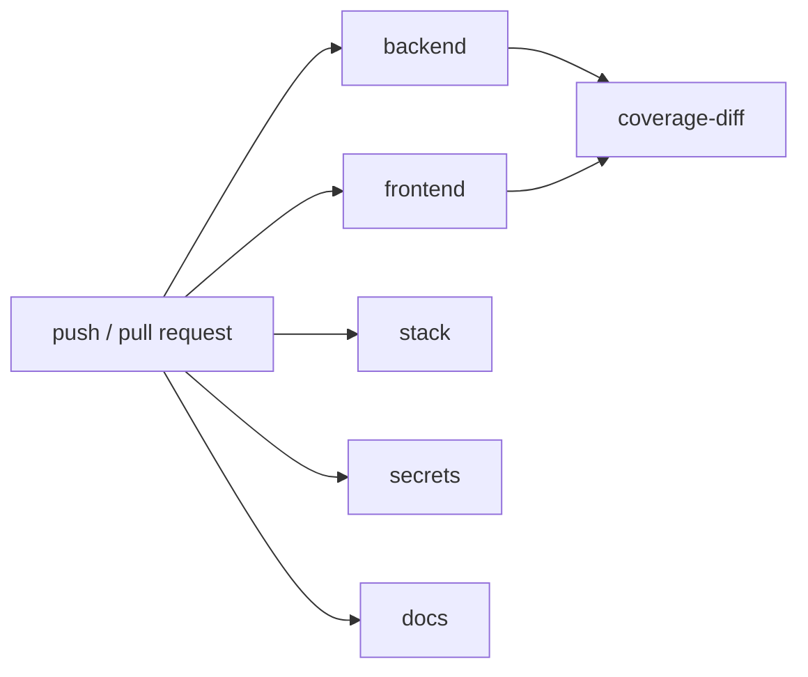

# Runbook di CI/CD

## Pipeline

La CI ordinaria non usa credenziali AWS reali. È un solo workflow, `.github/workflows/ci.yml`, che
gira a ogni push su qualunque branch, a ogni pull request, sui tag `v*` e su avvio manuale. Girare
anche sui branch di lavoro è voluto: chi sviluppa vede le suite rosse mentre lavora, non quando il
branch è già pronto per il merge.



Sei job; `backend`, `frontend` e `stack` passano da Docker Compose, `secrets`, `docs` e `coverage-diff` girano direttamente sul runner.

- **backend**: costruisce l'immagine dell'app ed esegue `composer validate`, Pint, Larastan, la
  verifica della Dependency Rule, Pest con copertura di righe e branch (Xdebug), le soglie globali e,
  per ultimo, l'audit delle dipendenze PHP di produzione. Xdebug è installato solo con
  `COMPOSER_INSTALL_DEV=true`, quindi manca dall'immagine di produzione. L'audit è in coda, come quello
  npm nel job frontend, così un advisory non nasconde l'esito dei test.
- **frontend**: sull'immagine Node esegue il lint del contratto OpenAPI, il controllo che il client
  generato sia allineato, ESLint, il typecheck, Jest con copertura di statement, funzioni e branch,
  le soglie globali, la build di produzione e un `npm audit` delle sole dipendenze di produzione a
  livello HIGH. Il typecheck copre anche le suite di test (`tsconfig.spec-typecheck.json`): Jest
  traspila le spec senza controllare i tipi, e senza questo passo un test potrebbe usare campi che
  non esistono nel modello generato e passare lo stesso.
- **coverage-diff**: dopo backend e frontend, applica il gate sulle righe modificate (vedi sotto).
- **stack**: controlli statici (Terraform `fmt`, `init` e `validate`; configurazioni di Collector,
  Prometheus, Alertmanager, Loki e Alloy), build delle immagini di produzione, scansione Trivy
  (`vuln,secret,config` a livello HIGH e CRITICAL), Terraform su LocalStack, build della SPA e
  caricamento nel bucket S3, smoke HTTPS dello stack servito (SPA da `edge-cdn` con fallback dei deep
  link, `/api`, `/health`, `/ready`, superfici bloccate, dashboard dietro basic auth), smoke dei log
  in Loki, accessibilità (axe, Pa11y e smoke con la CSP applicata) e infine la pubblicazione delle
  due immagini (`mvp-app`, `mvp-nginx`) su GHCR, tranne che sulle pull request. Il job gira con
  `COMPOSE_PROJECT_NAME=ci-smoke-<run_id>`, diverso dal nome della cartella: lo smoke dei log verifica
  che Loki riceva la label `service` e la `project` del run, cioè che la raccolta non dipenda dal nome
  del checkout.
- **secrets**: scansiona con gitleaks l'intera history Git, non solo l'albero corrente: un segreto
  tolto da un commit successivo resta leggibile in quelli precedenti. Le eccezioni sono in
  `.gitleaks.toml` e coprono solo le credenziali dimostrative dello stack locale.
- **docs**: `scripts/ci/check-markdown-links.mjs` verifica i link relativi e le anchor di tutti i
  file Markdown; i link esterni non vengono controllati, perché dipendono dalla rete.

Se uno smoke o un audit di accessibilità fallisce, l'artifact `stack-diagnostics` contiene
`docker compose ps`, i log di Compose con i timestamp e l'uso del disco di Docker; lo stack viene
comunque fermato dal passo di pulizia `if: always()`.

Ogni push e pull request dello stesso branch condividono un gruppo di `concurrency` con
`cancel-in-progress`: un push successivo annulla la run precedente ancora in corso. I job che usano
le immagini esterne le prendono dal mirror su GHCR, con autenticazione, e ripiegano sui registry
pubblici con retry; il job `stack` usa anche la cache di Actions.

Workflow di supporto:

- `aws-smoke.yml`: manuale (`workflow_dispatch`) e mai bloccante, prova S3, Textract e Bedrock reali.
  Vedi "Smoke su AWS reale".
- `mirror-images.yml`: copia su GHCR le immagini esterne usate dalla CI, ogni settimana e quando
  cambia la lista delle immagini su `develop` o `main`.

## Sicurezza della pipeline

- **Action fissate per SHA.** Ogni `uses:` punta a uno SHA di commit, con la versione in commento
  (`actions/checkout@<sha> # v5.1.0`): un tag spostato a monte non cambia ciò che gira. Gli
  aggiornamenti arrivano da Dependabot.
- **Strumenti a versione fissa.** Redocly CLI (`@redocly/cli@2.57.0`), `diff-cover==10.4.1`, Trivy
  e gitleaks per tag o digest: un rilascio nuovo non cambia il gate senza un commit.
- **Permessi minimi.** A livello di workflow il token ha `contents: read` e `packages: read`, che
  bastano per leggere il codice e il mirror. `packages: write` è concesso solo al job `stack`, che
  pubblica le immagini.
- **Dependabot** (`.github/dependabot.yml`): aggiornamenti settimanali per Composer, npm, GitHub
  Actions, Dockerfile e immagini del compose, con minor e patch raggruppate. Le PR passano dalla CI e
  da una revisione, senza merge automatico.

## Audit delle dipendenze

Sia le dipendenze Node sia quelle PHP sono verificate, ma con soglie costruite in modo diverso.

Lato Node basta `npm audit --omit=dev --audit-level=high`: il database degli advisory npm ha sempre
una severità, quindi filtrare su quella è affidabile.

Lato PHP serve `scripts/ci/check-composer-advisories.mjs`, perché `composer audit` non sa filtrare
per severità: passa o fallisce su tutto. Lo script legge il report JSON e fallisce su `high`,
`critical` **e sugli advisory senza severità dichiarata**, lasciando passare solo `low` e `moderate`
espliciti. L'ultimo caso non è raro: la fonte degli advisory PHP (`FriendsOfPHP/security-advisories`)
lascia spesso `severity` a `null`, come per CVE-2026-54133 su `mtdowling/jmespath.php`, che GitHub
classifica 9.8 critical. Un gate che filtrasse solo su `high` l'avrebbe lasciato passare.

Due opzioni contano:

- `--locked` controlla ciò che dichiara il lockfile, non il `vendor/` dentro l'immagine, così il gate
  non descrive quello che era installato all'ultima build;
- `--abandoned=report` è necessario: Composer, con la configurazione predefinita, fallisce anche sui
  pacchetti abbandonati, e il job si romperebbe il giorno in cui un pacchetto viene marcato così, che
  non è una vulnerabilità.

Quando un advisory non si può correggere perché dipende da un rilascio a monte, va dichiarato in
`composer.json` sotto `config.audit.ignore`, con il motivo: l'eccezione resta esplicita e
revisionabile invece di indebolire il gate per tutto.

## Copertura

La fonte delle soglie è `coverage-thresholds.json`:

- backend: 80% delle righe e 70% dei branch;
- frontend: 80% degli statement, 80% delle funzioni e 70% dei branch;
- righe modificate: 80%, letto dallo stesso file dal job `coverage-diff`.

I minimi sono rigidi: una copertura totale sotto un minimo fa sempre fallire il job, senza
tolleranze né baseline mantenute a mano. Jest applica i minimi del frontend con
`coverageThreshold.global`; sul backend l'unico gate globale è
`scripts/ci/check-coverage-thresholds.mjs`, che controlla ogni metrica aggregata, branch compresi.

```bash
make backend-coverage
make frontend-coverage
```

La path coverage del backend è più lenta della suite Pest ordinaria e usa 1 GB di memoria PHP. I
report finiscono in `coverage/` e `apps/frontend/coverage/`, entrambi esclusi da Git.

### Copertura delle righe modificate

`coverage-diff` misura le righe modificate rispetto al **commit base dell'evento** che ha avviato
la run:

| Evento | Base |
| --- | --- |
| `pull_request` | `github.event.pull_request.base.sha` |
| `push` | `github.event.before`, il commit precedente al push |
| Creazione di un branch o di un tag, `workflow_dispatch`, base non più raggiungibile | merge-base con il default branch, con un warning nel log |

Un ref di branch non viene mai usato come base: su un push punta già al commit appena pubblicato e il
diff sarebbe vuoto, cioè un gate che passa senza misurare nulla. `diff-cover` confronta con la
notazione a tre punti, quindi misura le modifiche dal merge-base fra base e `HEAD`.

PHPUnit scrive il report Cobertura con i percorsi del container: `<source>` contiene la radice
assoluta e ogni `filename` è relativo a quella. `scripts/ci/normalize-cobertura-paths.mjs` riscrive
`<source>` in un percorso relativo al repository prima che il report lasci il job backend, perché
`diff-cover` risolve ogni classe come `join(<source>, filename)`: senza questo passo nessun file
modificato verrebbe agganciato e il gate misurerebbe zero righe. Lo script fa fallire il job se il
report non ha la forma attesa.

I due stack si misurano con due invocazioni, perché `diff-cover` non accetta report XML e LCov
insieme:

```bash
diff-cover coverage/backend/cobertura.xml --compare-branch="$BASE_SHA" --fail-under=80
diff-cover coverage/frontend/lcov.info --compare-branch="$BASE_SHA" --fail-under=80
```

Ogni report descrive solo i propri file, quindi le due misure non si sovrappongono. Le invocazioni
girano sempre entrambe e i loro esiti si combinano. Un commit che tocca un solo stack lascia l'altro
a zero righe misurate, che per `diff-cover` è un esito positivo; il log riporta per ogni stack base,
head e righe misurate, e aggiunge un avviso quando nessuna riga è stata misurata. Il job pubblica
report HTML, Markdown e JSON. Gli artifact con i dati di copertura restano 1 giorno, i report 7.

## Smoke su AWS reale

`aws-smoke.yml` prova le integrazioni AWS reali: put, head e delete su S3, `detect-document-text` di
Textract, `converse` di Bedrock. Accetta due modalità di credenziali, in ordine di preferenza:

1. **OIDC**: l'ARN del ruolo IAM come input `aws_role_arn`; il workflow lo assume tramite GitHub OIDC
   (`id-token: write`), senza credenziali salvate.
2. **Secret effimeri**: credenziali di sessione a breve durata come secret `AWS_REAL_ACCESS_KEY_ID`,
   `AWS_REAL_SECRET_ACCESS_KEY` e `AWS_REAL_SESSION_TOKEN`, caricate subito prima della run e
   lasciate scadere dopo. Credenziali statiche di lunga durata non vanno mai salvate.

La configurazione non sensibile arriva dalle variabili del repository (`AWS_REAL_REGION`,
`AWS_REAL_S3_BUCKET`, `BEDROCK_REGION`, `BEDROCK_MODEL_ID`, ...), con default allineati a
`docker-compose.yml`. Senza credenziali il workflow si chiude con un avviso. I permessi necessari sono
nella [matrice IAM](../security/iam-and-aws-permissions.md).

`make aws-smoke` non è lo smoke: è un controllo locale della configurazione nel `.env`.

## Riferimenti

- GitHub Actions OIDC per AWS: https://docs.github.com/en/actions/deployment/security-hardening-your-deployments/configuring-openid-connect-in-amazon-web-services
- Indurimento della sicurezza di GitHub Actions: https://docs.github.com/en/actions/security-for-github-actions/security-guides/security-hardening-for-github-actions
- Build Docker con GitHub Actions: https://docs.docker.com/build/ci/github-actions/
