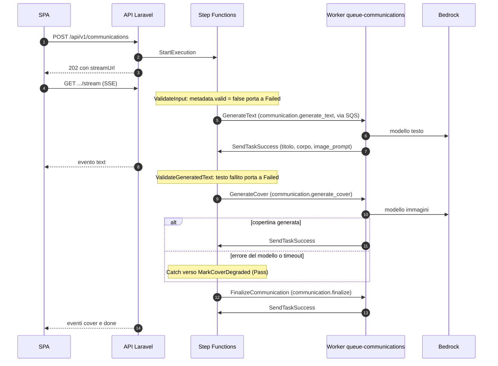

# Runbook della pipeline delle comunicazioni

## Flusso normale

Stati della state machine (`infra/localstack/state-machines/communication-pipeline.asl.json`):
`ValidateInput` → `GenerateText` → `ValidateGeneratedText` → `GenerateCover` →
`FinalizeCommunication` → `Completed`. Se `GenerateCover` fallisce anche dopo il retry, il ramo
`MarkCoverDegraded` porta comunque a `FinalizeCommunication`: una copertina mancante degrada la
comunicazione, non la invalida.



1. La SPA invia prompt, tono e stile a `POST /api/v1/communications`.
2. `GenerateCommunicationRequest` li valida.
3. Il controller salva la comunicazione con `generation_status=pending` e risponde **202** con uno
   `streamUrl` relativo.
4. `StartCommunicationWorkflowService::start()` avvia l'esecuzione Step Functions e ne salva i
   metadati su `communications`, sotto lock nella stessa transazione.
5. Step Functions pubblica i task con callback token sulla coda SQS delle comunicazioni.
6. `php artisan mvp:workflow:consume --queue=communications` riceve ogni messaggio, esegue il task
   tramite `CommunicationWorkflowTaskHandler` e chiama `SendTaskSuccess` o `SendTaskFailure`.
7. `communication.generate_text` chiama Bedrock e salva `generated_title`, `generated_body` e
   `image_prompt`. È il modello del testo, con il testo davanti, a scrivere anche la direzione visiva
   della copertina: l'immagine segue la comunicazione reale, non il prompt grezzo dell'operatore.
   Un errore qui fa fallire l'esecuzione, perché la comunicazione è il testo.
8. `communication.generate_cover` manda `image_prompt` al modello immagini e salva il risultato sul
   disco delle copertine (`MVP_COMMUNICATION_COVER_DISK`, di default S3 emulato) sotto
   `MVP_COMMUNICATION_COVER_PREFIX`. Senza direzione visiva usa un soggetto aziendale generico. Un
   errore qui viene registrato in `cover_status` e `cover_error` e il task riesce comunque.
9. `communication.finalize` imposta `generation_status=completed`, chiude una copertina rimasta in
   attesa dopo il ramo degradato e registra le metriche.
10. La SPA segue `GET /api/v1/communications/{communication}/stream` e riceve gli eventi `progress`,
    `text`, `cover`, `done` ed `error`. Il testo arriva circa dieci secondi prima della copertina.
11. A generazione conclusa, la SPA mostra il documento impaginato con
    `GET /api/v1/communications/{communication}/preview` (inline) e `GET .../export` (allegato).
    Entrambi richiedono una comunicazione completata e non scartata, altrimenti rispondono **422**.
    Vedi "PDF finale".

## Configurazione runtime richiesta

| Variabile | Serve a | Note |
| --- | --- | --- |
| `COMMUNICATION_PIPELINE_STATE_MACHINE_ARN` | Avvio del workflow dall'API | Creata da Terraform in LocalStack. |
| `COMMUNICATION_PIPELINE_TASK_QUEUE_URL` | API e worker | Coda dei task con callback token, separata da quella documentale. |
| `COMMUNICATION_PIPELINE_DLQ_URL` | Diagnostica della DLQ | Usata da `mvp:dlq:list --queue=communications`. |
| `MVP_COMMUNICATION_COVER_DISK` | Storage delle copertine | Di default S3 emulato (`s3`), anche quando i documenti passano a `real_s3` per Textract: le copertine sono asset generati, non documenti HR. |
| `MVP_COMMUNICATION_COVER_PREFIX` | Storage delle copertine | Prefisso delle chiavi, di default `communications/covers`. |
| `MVP_COMMUNICATION_PDF_DISK` | Cache del PDF finale | Disco dei PDF materializzati. Se manca usa `MVP_COMMUNICATION_COVER_DISK`, poi `FILESYSTEM_DISK`. |
| `MVP_COMMUNICATION_PDF_PREFIX` | Cache del PDF finale | Prefisso delle chiavi, di default `communications/exports`, separato dalle copertine perché le due famiglie si possano svuotare in modo indipendente. |
| `MVP_COMMUNICATION_TIMEOUT_SECONDS` | Rilevamento dei blocchi | Età oltre la quale una generazione in corso risulta bloccata. |
| `BEDROCK_MODEL_ID` | Generazione del testo | L'accesso al modello va abilitato nell'account AWS. |
| `BEDROCK_IMAGE_MODEL_ID` | Generazione della copertina | Default `stability.sd3-5-large-v1:0`. Il payload dipende dalla famiglia del modello (Stability SD3/Core, Stability XL, Nova Canvas). Senza un modello raggiungibile ogni copertina degrada con un avviso esplicito. |
| `BEDROCK_IMAGE_REGION` | Generazione della copertina | Regione del modello immagini (default `us-west-2`), di solito diversa da quella del testo; la copertina usa un client Bedrock dedicato. Vuota, riusa `BEDROCK_REGION`. |

Le due variabili della pipeline sono fra le `REQUIRED_KEYS` di `RuntimeConfigurationLoader`: dopo
un aggiornamento che le introduce, `make refresh-runtime` riscrive SSM e ricostruisce la cache.
`StartCommunicationWorkflowService::start()` fallisce comunque subito, con un messaggio chiaro, se
una delle due manca.

## Prova manuale

```bash
make setup
curl --insecure https://localhost:8443/health
```

Generare una comunicazione dalla SPA, poi:

```bash
make logs
docker compose exec app php artisan mvp:dlq:list --queue=communications
```

I log del worker sono anche in Grafana: dashboard `communication-pipeline`, oppure la query
`{project="<progetto>", service="queue-communications"}` nella dashboard `Logs and Errors`.

## Più worker

```bash
make workers WORKERS=2   # scala sia queue sia queue-communications
```

Più worker sono sicuri: ogni callback token è registrato in `workflow_tasks` (`task_token_hash`
univoco) e reclamato in modo atomico, quindi una consegna SQS duplicata non riesegue la logica di
business (`mvp_sqs_messages_duplicate_total` la conta). Il `visibility_timeout_seconds` della coda
(900 s) supera il timeout del task più lungo dell'ASL (300 s, la copertina). I worker inviano
`SendTaskHeartbeat` fra un tentativo di generazione dell'immagine e l'altro; un task rimasto
`running` per un worker morto torna reclamabile dopo `MVP_WORKFLOW_CLAIM_TTL_SECONDS` (default
900 s).

La coda delle comunicazioni è separata da quella documentale: una generazione di immagini lenta non
occupa i consumatori dell'altra pipeline, e ogni dominio ha la propria DLQ e i propri segnali di
backlog.

## Copertina degradata

Una copertina degradata è un esito previsto, non un incidente: la comunicazione resta valida e
utilizzabile, e la SPA mostra il motivo sotto l'anteprima.

| Motivo in `cover_error` | Label della metrica | Causa |
| --- | --- | --- |
| Modello immagini non configurato | `model_not_configured` | `BEDROCK_IMAGE_MODEL_ID` vuoto. |
| Account senza accesso al modello | `model_access_denied` | Accesso al modello non abilitato. |
| Modello obsoleto o non attivo | `model_not_available` | Il modello configurato non è più servito. |
| Credenziali non valide | `invalid_credentials` | `AWS_REAL_*` scadute o errate. |
| Bloccata dai controlli di sicurezza | `content_filter` | Il modello ha rifiutato prompt o output. |
| Generazione interrotta | `timeout` | Il ramo degradato dell'ASL ha chiuso una copertina rimasta in attesa. |

I motivi più frequenti:

```sql
SELECT cover_status, cover_error, count(*)
FROM communications
WHERE cover_status = 'failed'
GROUP BY cover_status, cover_error
ORDER BY count(*) DESC;
```

`CommunicationCoverGenerationDegraded` scatta solo oltre tre degradazioni in trenta minuti: un
singolo prompt rifiutato non allerta nessuno.

## PDF finale

`DompdfCommunicationPdfRenderer`, dietro `CommunicationPdfRendererPort` e orchestrato da
`ExportCommunicationService`, impagina titolo, corpo e copertina nel documento A4 servito da
`preview` ed `export`. Ogni pagina porta il marcatore di trasparenza `Creato da AI Assistant`, sia
come filigrana diagonale sia nel piè di pagina (marchio a sinistra, marcatore al centro, numero di
pagina a destra), disegnato con l'API canvas di dompdf perché dompdf non gestisce i margin box CSS3.

Il rendering è l'operazione più costosa dell'API e il risultato è deterministico, quindi il PDF viene
**materializzato una volta** sul disco e poi riletto:

- la chiave è un'impronta SHA-1 di titolo, corpo, stato, percorso e MIME della copertina, in
  `{MVP_COMMUNICATION_PDF_PREFIX}/{id}/{impronta}.pdf`;
- **l'invalidazione è implicita**: se cambiano testo o copertina cambia l'impronta, viene scritto un
  oggetto nuovo e quello vecchio non viene più chiesto. Nessun hook di invalidazione nei servizi che
  modificano una comunicazione;
- l'impronta è anche l'`ETag`: con un `If-None-Match` uguale la risposta è **304**, senza toccare
  dompdf né lo storage.

L'impronta non vede le modifiche al template Blade, alla filigrana o al piè di pagina. Per quelle
c'è `DompdfCommunicationPdfRenderer::RENDER_VERSION`: **va incrementata nello stesso commit che
cambia l'impaginazione**, altrimenti i PDF già materializzati continuano a uscire con quella vecchia.

La cache è un'ottimizzazione, mai una dipendenza. Se il disco manca o è configurato male,
`Storage::disk()` lancia un'eccezione già alla risoluzione: il servizio la intercetta, la segnala e
rifà il rendering a ogni richiesta, così l'export funziona anche in degrado. Il test
`the export survives an unavailable PDF cache disk` in `MvpAppRoutesTest` fissa il comportamento.

Le due rotte hanno un `throttle:30,1` esplicito, più stretto del limite di gruppo di 60 al minuto:
sono le risposte più pesanti dell'API e partono da un clic, non dal rendering di un elenco.

Per svuotare le copie materializzate, che si ricostruiscono alla richiesta successiva:

```bash
docker compose exec app php artisan tinker --execute="Storage::disk(config('mvp.communications.pdf_disk'))->deleteDirectory(config('mvp.communications.pdf_prefix'));"
```

## Timeout dello stream SSE e pool PHP-FPM

`CommunicationStreamController::stream()` invia l'avanzamento via SSE per al massimo
`mvp.communications.stream_timeout_seconds` (default 900 s). Allo scadere invia `still_running`, non
`error`: la SPA lascia attivo l'avanzamento, perché il worker sta ancora lavorando. Il pool PHP-FPM,
condiviso dagli stream delle due pipeline sul servizio `app`, è dimensionato per questo: vedi la
sezione corrispondente di [`document-pipeline.md`](document-pipeline.md#timeout-dello-stream-sse-e-pool-php-fpm).

## Fallimenti

| Fallimento | Segnale osservabile | Azione |
| --- | --- | --- |
| Avvio del workflow fallito | `workflow_failed_at`, evento di audit, `mvp_stepfunctions_executions_failed_total` | Controllare l'ARN della state machine e l'URL della coda, poi `make refresh-runtime`. |
| Task SQS fallito | `workflow_tasks.status=failed`, log del worker, alert `CommunicationPipelineTaskFailed` | Ispezionare la DLQ e l'errore del task ([`dlq-recovery.md`](dlq-recovery.md)). |
| Generazione del testo fallita | `generation_status=failed`, `error_message` sulla comunicazione | Controllare accesso al modello, ID del modello e credenziali. |
| Copertina degradata | `cover_status=failed`, `mvp_communication_covers_failed_total{reason}` | Vedi "Copertina degradata"; nessuna azione per eventi isolati. |
| Storage delle copertine non disponibile | `mvp_communication_cover_storage_failed_total{operation}`, alert `CommunicationCoverStorageFailing` | Controllare bucket, prefisso e credenziali del disco. |
| Comunicazione bloccata | `mvp_communications_stuck_processing`, alert `CommunicationStuckInProcessing` | Controllare worker, coda SQS ed esecuzione Step Functions. |
| Cache del PDF non disponibile | Eccezione segnalata da `DompdfCommunicationPdfRenderer`, nessun 5xx all'utente | Anteprima ed export funzionano ma rifanno il rendering ogni volta: controllare `MVP_COMMUNICATION_PDF_DISK`, bucket e credenziali. |
| Impaginazione vecchia dopo una modifica del template | Il PDF esportato mostra ancora il layout precedente | `RENDER_VERSION` non è stata incrementata: incrementarla o svuotare il prefisso. |
| Stream SSE scaduto (`still_running`) | La SPA continua a leggere lo stato, nessun errore mostrato | Non è un fallimento: controllare `mvp_communications_stuck_processing` prima di supporlo. |
