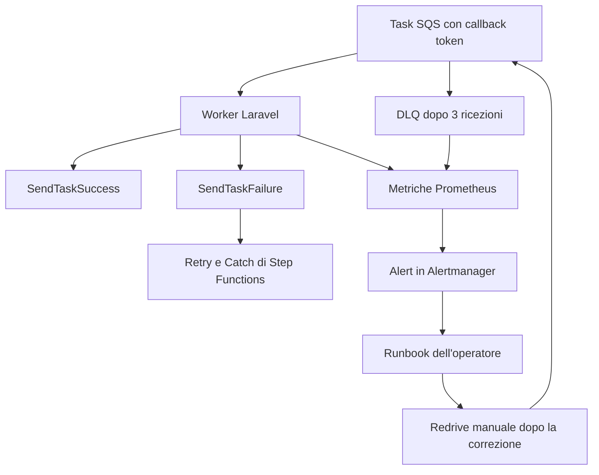

# Runbook delle DLQ e del recupero

## Come funziona

Step Functions pubblica i task con callback token su SQS. Ogni pipeline ha la propria coda, quindi
un backlog in un dominio non rallenta l'altro. Entrambe le code hanno:

- `visibility_timeout_seconds = 900`
- `message_retention_seconds = 345600` (4 giorni)
- `maxReceiveCount = 3`: un messaggio ricevuto tre volte senza essere cancellato passa alla DLQ.

| Pipeline | Coda | DLQ | Ispezione |
| --- | --- | --- | --- |
| Documenti | `mvp-documents` | `mvp-documents-dlq` | `mvp:dlq:list --queue=documents` |
| Comunicazioni | `mvp-communications` | `mvp-communications-dlq` | `mvp:dlq:list --queue=communications` |

I worker registrano ogni task in `workflow_tasks` per `task_token_hash`, qualunque sia il dominio. I
task riusciti o saltati sono idempotenti: se lo stesso token si ripresenta, non vengono rieseguiti.

`ConsumeWorkflowTasks::sendCallback()` classifica il rifiuto di un `SendTaskSuccess` o
`SendTaskFailure` prima di decidere se cancellare il messaggio SQS:

- su un errore AWS **transitorio** (throttling, servizio non disponibile, ...) il messaggio resta in
  coda per una normale riconsegna;
- su un errore **permanente** (`TaskTimedOut`, `TaskDoesNotExist`, `InvalidToken`), dove un nuovo
  tentativo con lo stesso token non può riuscire, il messaggio viene cancellato subito. L'esito di
  business è già registrato in `workflow_tasks` e sul record di dominio; lasciarlo in coda
  produrrebbe solo `maxReceiveCount` tentativi e una DLQ piena di falsi fallimenti per lavoro già
  concluso.

Un messaggio che arriva in DLQ è quindi un errore transitorio ripetuto tre volte, oppure un worker
che si è fermato prima di cancellare il messaggio.



## Ispezionare una DLQ

```bash
docker compose exec app php artisan mvp:dlq:list --queue=documents
```

Il comando legge fino a 10 messaggi dalla DLQ con `VisibilityTimeout=0` e ne stampa un'anteprima. È
uno strumento diagnostico e non registra metriche: la profondità delle code la misura `DlqDepthProbe`,
che legge `ApproximateNumberOfMessages` a ogni scrape.

## Procedura di recupero

1. Aprire in Grafana la dashboard `Queues and DLQ`.
2. Eseguire `mvp:dlq:list --queue=<pipeline>` e annotare id e anteprima dei messaggi.
3. Cercare in `workflow_tasks` stato ed errore del task (`subject_type` indica il dominio).
4. Leggere `original_documents.workflow_failure_reason` o `communications.workflow_failure_reason`.
5. Correggere la causa: permessi IAM, chiave S3 errata, accesso al modello, payload non valido.
6. Riportare i messaggi dalla DLQ alla coda di origine con la console o la CLI dell'ambiente.
7. Verificare l'idempotenza: i task già riusciti e duplicati devono risultare saltati.

La MVP implementa l'ispezione diagnostica delle DLQ e i record idempotenti dei task. Il replay
automatico non è implementato di proposito: il meccanismo definitivo dipende dai controlli operativi
e dai confini IAM dell'ambiente di destinazione.

## Metriche utili

| Metrica | Significato |
| --- | --- |
| `mvp_sqs_messages_received_total` | Messaggi di task ricevuti dai worker. |
| `mvp_sqs_messages_failed_total` | Task falliti nei worker. |
| `mvp_dlq_messages{queue}` | Messaggi presenti nella DLQ di ogni pipeline, letti da SQS a ogni scrape. Assente se il probe fallisce. |
| `mvp_dlq_probe_up{queue}` | 1 se la profondità è stata letta, 0 altrimenti. `DLQNotEmpty` è affidabile solo mentre vale 1. |
| `mvp_documents_stuck_processing` | Documenti oltre il timeout di elaborazione. |
| `mvp_communications_stuck_processing` | Comunicazioni oltre il timeout di generazione. |
| `mvp_stepfunctions_executions_started_total` | Avvii dei workflow. |
| `mvp_stepfunctions_executions_failed_total` | Avvii falliti e task falliti dei workflow. |
