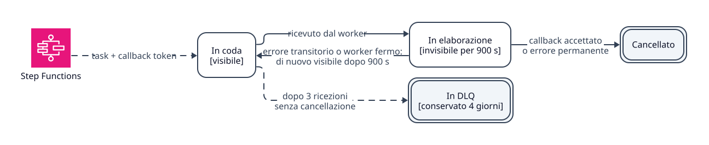

# Runbook delle DLQ e del recupero

Usa questo runbook quando scattano `DLQNotEmpty`, `CommunicationDLQNotEmpty` o `DlqProbeDown`, oppure
quando la dashboard `Queues and DLQ` mostra messaggi in una DLQ.

## Cosa indica un messaggio in DLQ



*Stati di un messaggio di task in SQS. Tratteggio: passaggi gestiti da SQS e Step Functions.*

Step Functions pubblica i task con callback token su SQS; ogni pipeline ha la propria coda e la
propria DLQ:

| Pipeline | Coda | DLQ | Ispezione |
| --- | --- | --- | --- |
| Documenti | `mvp-documents` | `mvp-documents-dlq` | `mvp:dlq:list --queue=documents` |
| Comunicazioni | `mvp-communications` | `mvp-communications-dlq` | `mvp:dlq:list --queue=communications` |

Entrambe le code hanno `visibility_timeout_seconds = 900`, `message_retention_seconds = 345600`
(4 giorni) e `maxReceiveCount = 3`.

`ConsumeWorkflowTasks::sendCallback()` distingue due casi quando Step Functions rifiuta un callback:

- errore AWS transitorio (throttling, servizio non disponibile): il messaggio resta in coda e torna
  visibile dopo 900 s;
- errore permanente (`TaskTimedOut`, `TaskDoesNotExist`, `InvalidToken`): il messaggio viene
  cancellato, perché un nuovo tentativo con lo stesso token non può riuscire.

Un messaggio in DLQ è quindi un errore transitorio ripetuto tre volte, oppure un worker che si è
fermato prima di cancellare il messaggio. Fra la prima ricezione e lo spostamento in DLQ passano
almeno 1800 s, mentre il timeout più lungo di un task è 720 s: quando il messaggio arriva in DLQ,
il task Step Functions è già scaduto e l'esecuzione ha ritentato con un nuovo token o è terminata
in `Failed`. Riportare il messaggio in coda (redrive) non completa il lavoro: il callback
fallirebbe con `TaskTimedOut` e il worker cancellerebbe il messaggio. Il recupero è il riavvio del
flusso.

## Procedura di recupero

1. Elenca i messaggi della DLQ (fino a 10, con `VisibilityTimeout=0`) e annota id e anteprima:

   ```bash
   docker compose exec app php artisan mvp:dlq:list --queue=documents
   ```

   Per le comunicazioni usa `--queue=communications`.

2. Cerca il task e il suo errore in `workflow_tasks` (`subject_type` indica il dominio):

   ```bash
   docker compose exec -T postgres sh -lc 'psql -U "$POSTGRES_USER" "$POSTGRES_DB" -c "select id, subject_type, subject_id, task_type, status, error_message, failed_at from workflow_tasks where completed_at is null order by updated_at desc limit 20;"'
   ```

3. Leggi il motivo del fallimento sul record di dominio: `original_documents.workflow_failure_reason`
   oppure `communications.workflow_failure_reason`.

4. Correggi la causa: permessi IAM, chiave S3 errata, accesso al modello, payload non valido.

5. Riavvia il flusso:
   - comunicazioni: `POST /api/v1/communications/{id}/regenerate`;
   - documenti: nuovo upload del PDF, perché non esiste una route di riavvio.

6. Svuota la DLQ dopo l'analisi, altrimenti l'alert resta attivo fino alla scadenza dei messaggi
   (4 giorni):

   ```bash
   docker compose --profile tools run --rm aws-cli -c 'aws sqs purge-queue --queue-url <url-della-dlq>'
   ```

   Gli URL sono in `SQS_DLQ_URL` (documenti) e `COMMUNICATION_PIPELINE_DLQ_URL` (comunicazioni).

Verifica: `mvp_dlq_messages{queue}` torna a 0 nella dashboard `Queues and DLQ` e il flusso riavviato
arriva a `Completed`.

Se `DlqProbeDown` è attivo, la profondità delle DLQ non è leggibile e `DLQNotEmpty` non è affidabile:
controlla prima che LocalStack sia raggiungibile dal container `app`.

## Metriche utili

| Metrica | Significato |
| --- | --- |
| `mvp_sqs_messages_received_total` | Messaggi di task ricevuti dai worker. |
| `mvp_sqs_messages_failed_total` | Task falliti nei worker. |
| `mvp_dlq_messages{queue}` | Messaggi presenti nella DLQ di ogni pipeline, letti da SQS a ogni scrape. Assente se il probe fallisce. |
| `mvp_dlq_probe_up{queue}` | 1 se la profondità è stata letta, 0 altrimenti. `DLQNotEmpty` è affidabile solo mentre vale 1. |
| `mvp_documents_stuck_processing` | Documenti oltre il timeout di elaborazione. |
| `mvp_communications_stuck_processing` | Comunicazioni oltre il timeout di generazione. |
| `mvp_stepfunctions_executions_started_total` | Avvii dei workflow. |
| `mvp_stepfunctions_executions_failed_total` | Avvii falliti e task falliti dei workflow. |
