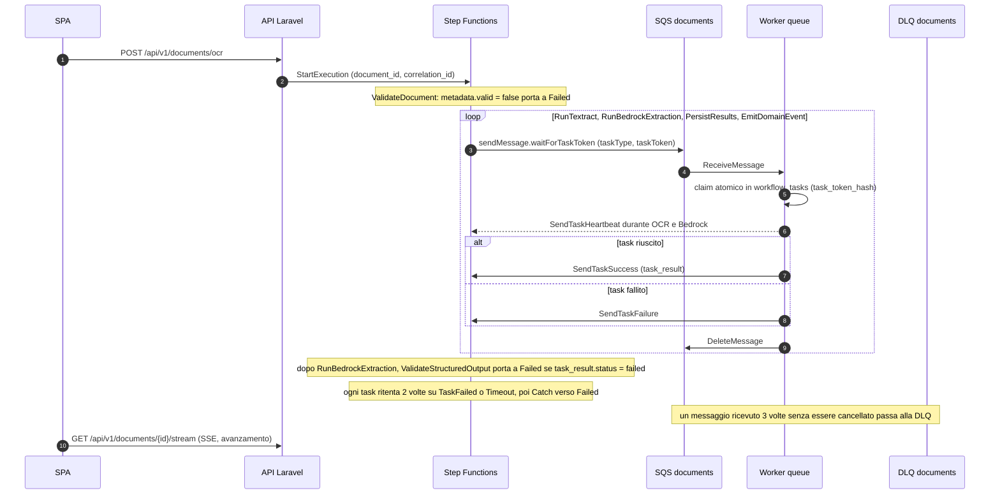

# Runbook della pipeline documentale

## Flusso normale

Stati della state machine (`infra/localstack/state-machines/document-pipeline.asl.json`):
`ValidateDocument` → `RunTextract` → `RunBedrockExtraction` → `ValidateStructuredOutput` →
`PersistResults` → `EmitDomainEvent` → `Completed`, con `Failed` come uscita di errore.



1. La SPA invia il PDF a `POST /api/v1/documents/ocr`.
2. `UploadDocumentRequest` controlla tipo MIME, dimensione, nome file, leggibilità del PDF, numero
   di pagine e, se attivi, i limiti di Textract.
3. `UploadDocumentService::upload()` salva l'originale sul disco documenti configurato.
4. `StartDocumentWorkflowService::start()` avvia l'esecuzione Step Functions e ne salva i metadati
   su `original_documents`, nella stessa transazione e sotto lock: due richieste ravvicinate non
   avviano due esecuzioni.
5. Step Functions pubblica i task con callback token sulla coda SQS.
6. `php artisan mvp:workflow:consume --queue=documents` riceve ogni messaggio, esegue il task tramite
   `DocumentWorkflowTaskHandler` e chiama `SendTaskSuccess` o `SendTaskFailure`.
7. `textract.ocr` chiama Textract reale solo con `TEXTRACT_ENABLED=true` e salva il testo OCR per
   pagina (`ocr_text`, `ocr_pages`) usato dal passo successivo.
8. `bedrock.extract` classifica il documento, lo divide per destinatario ed estrae i campi, sempre
   dal testo OCR (Converse solo testo, senza blocco PDF), e salva `sub_documents` ed
   `extracted_data`. La confidenza viene dalla leggibilità OCR, non dall'autovalutazione del
   modello: ogni campo prende la confidenza della riga da cui proviene e il sotto-documento quella
   del suo campo chiave più debole, con una soglia più alta per il codice fiscale
   ([ADR 0013](../architecture-decisions/0013-per-field-ocr-confidence.md)).
9. `persist.results` restituisce lo stato di elaborazione corrente.
10. `dispatch.domain_event` registra il completamento del workflow e le metriche.

## Configurazione runtime richiesta

| Variabile | Serve a | Note |
| --- | --- | --- |
| `DOCUMENT_PIPELINE_STATE_MACHINE_ARN` | Avvio del workflow dall'API | Creata da Terraform in LocalStack. |
| `DOCUMENT_PIPELINE_TASK_QUEUE_URL` | API e worker | Coda SQS dei task con callback token. |
| `SQS_DLQ_URL` | Diagnostica della DLQ | Usata da `mvp:dlq:list --queue=documents` e dal probe delle DLQ. |
| `MVP_DOCUMENT_DISK` | Storage degli upload | `s3` per LocalStack, `real_s3` per Textract reale. |
| `AWS_REAL_*` | S3 e Textract reali | Mai nel repository. |
| `TEXTRACT_ENABLED` | OCR | `false` di default in locale e in CI. Richiede `MVP_DOCUMENT_DISK=real_s3`. Ignorata nel profilo local. |
| `BEDROCK_MODEL_ID` | Estrazione AI | L'accesso al modello va abilitato nell'account AWS. |
| `MVP_EXECUTION_PROFILE` | Provider di OCR e AI | `local` sostituisce Textract e Bedrock con l'OCR locale e Ollama, senza cambiare il flusso ([`local-development.md`](local-development.md#profilo-di-esecuzione-locale)). |

Con `TEXTRACT_ENABLED=true`, `MVP_DOCUMENT_DISK` deve valere `real_s3`: Textract reale legge solo
oggetti su S3 reale, quindi `StartDocumentWorkflowService::start()` rifiuta subito il workflow, con
un errore esplicito, se l'OCR è attivo e i documenti stanno su LocalStack. La chiave S3 passata a
Textract include il prefisso del disco (`AWS_REAL_S3_PREFIX`).

## Prova manuale

```bash
make setup
curl --insecure https://localhost:8443/health
curl --insecure https://localhost:8443/ready
```

Caricare un PDF dalla SPA (in `demo/pdf/dataset/` ce ne sono di prova), poi:

```bash
make logs
docker compose exec app php artisan mvp:dlq:list --queue=documents
```

I log dei worker sono anche in Grafana: dashboard `document-pipeline` e `ai-ocr-quality`, oppure la
query `{project="<progetto>", service="queue"}` nella dashboard `Logs and Errors`, dove
`<progetto>` è il progetto Compose del checkout ([`observability.md`](observability.md#flusso-dei-log)).

Il percorso con S3 e Textract reali si prova a parte. `make aws-smoke` è solo un controllo di
configurazione; lo smoke vero su S3, Textract e Bedrock è il workflow manuale `aws-smoke.yml`
([`ci-cd.md`](ci-cd.md)).

## Più worker

```bash
make workers WORKERS=2   # scala sia queue sia queue-communications
```

Più worker sono sicuri. Ogni callback token è registrato in `workflow_tasks` (`task_token_hash`
univoco) e reclamato in modo atomico: una consegna SQS duplicata viene consumata senza rieseguire la
logica di business, e `mvp_sqs_messages_duplicate_total` la conta. Il `visibility_timeout_seconds`
delle code (900 s, in Terraform) supera il timeout del task più lungo dell'ASL (720 s), quindi un
messaggio in lavorazione non torna visibile a un secondo worker. I worker inviano
`SendTaskHeartbeat` mentre attendono Textract e fra un segmento Bedrock e l'altro; un task rimasto
`running` per un worker morto torna reclamabile dopo `MVP_WORKFLOW_CLAIM_TTL_SECONDS` (default
900 s).

## Timeout dello stream SSE e pool PHP-FPM

`DocumentController::stream()` invia l'avanzamento via SSE per al massimo
`mvp.documents.stream_timeout_seconds` (default 1800 s). Il caso peggiore senza retry è 1380 s, la
somma dei timeout dei task nell'ASL: Textract 420 s, Bedrock 720 s, persistenza 120 s, dispatch
120 s. Con i retry può superare lo stream. Allo scadere invia `still_running`,
non `error`: la SPA lascia attivo l'avanzamento e non lo tratta come fallimento. Il worker sta ancora
lavorando; è solo la vista in tempo reale ad aver smesso di seguirlo, e il successivo
`GET /api/v1/state` riporta l'esito.

Ogni stream aperto tiene occupato un processo PHP-FPM del servizio `app` per tutta la durata. Il pool
è dimensionato apposta in `docker/php/www-pool.conf` (`pm.max_children = 20`, contro i 5 di default
dell'immagine `php:8.4-fpm`): con il default bastavano 3-5 upload concorrenti per esaurire i processi
e bloccare `/health`, `/ready` e ogni altro endpoint fino alla fine di uno stream. Se il carico
cresce, va alzato `pm.max_children`, verificando la memoria del container, prima di allungare il
timeout dello stream.

## Fallimenti

| Fallimento | Segnale osservabile | Azione |
| --- | --- | --- |
| Avvio del workflow fallito | `workflow_failed_at`, evento di audit, `mvp_stepfunctions_executions_failed_total`, alert `StepFunctionExecutionFailed` | Controllare `DOCUMENT_PIPELINE_STATE_MACHINE_ARN` e `DOCUMENT_PIPELINE_TASK_QUEUE_URL`. |
| Task SQS fallito | `workflow_tasks.status=failed`, log del worker | Ispezionare la DLQ e l'errore del task ([`dlq-recovery.md`](dlq-recovery.md)). |
| Textract fallito | `mvp_textract_jobs_failed_total`, alert `TextractFailureRateHigh` | Controllare la chiave dell'oggetto S3, i permessi IAM e i limiti di Textract. |
| Bedrock fallito | Messaggio di errore sul documento o sul sotto-documento, `mvp_sqs_messages_failed_total{task_type="bedrock.extract"}`, alert `BedrockFailureRateHigh` | Controllare accesso al modello, ID del modello e credenziali. |
| Documento bloccato | `mvp_documents_stuck_processing`, alert `DocumentStuckInProcessing` | Controllare worker, coda SQS ed esecuzione Step Functions. |
| Coda ferma | alert `QueueBacklogHigh`: documenti in elaborazione ma nessun messaggio consumato negli ultimi 30 minuti | Verificare che il worker sia attivo (`docker compose ps queue`) e leggerne i log; riavviarlo con `docker compose restart queue`. |
| Stream SSE scaduto (`still_running`) | La SPA continua a leggere lo stato, nessun errore mostrato | Non è un fallimento: controllare `mvp_documents_stuck_processing` prima di supporlo. |
